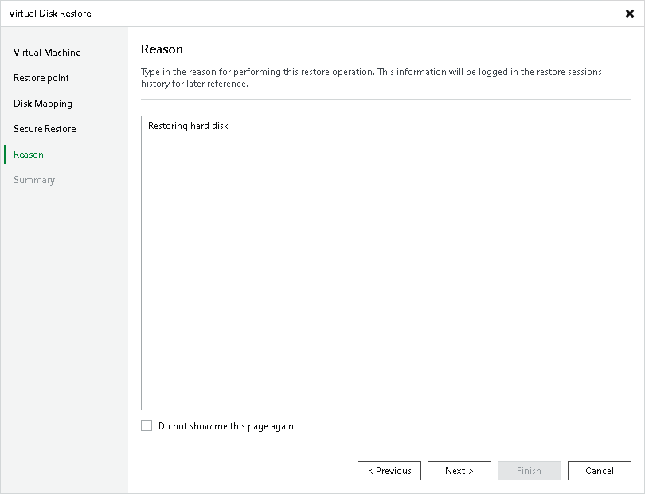

# Step 6. Specify Restore Reason

At the Reason step of the wizard, enter a reason for restoring VM disks. The information you provide will be saved in the session history and you can reference it later.

|  |
| --- |
| Tip |
| If you do not want to show this page, select the Do not show me this page again check box. If you want to unhide this page, follow the instructions described in [this Veeam KB article](https://www.veeam.com/kb4432). |

