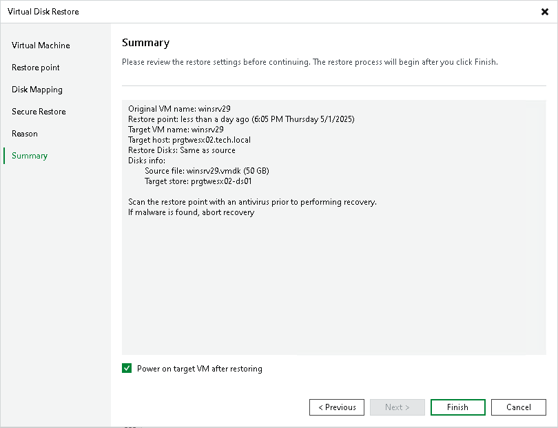

# Step 7. Finish Working with Wizard

In this article

At the Summary step of the wizard, review the configured settings and click Finish.

If you want to start the VM to which the disk will be attached right after restore, select the Power on target VM after restoring check box.

Page updated 1/25/2024

Page content applies to build 13.0.1.1071
