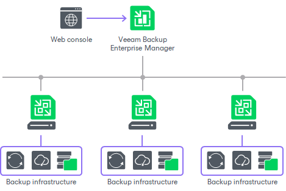

# Distributed Deployment

In this article

The distributed deployment scenario is recommended for large geographically dispersed virtual environments with multiple Veeam Backup & Replication servers installed across different sites. These backup servers are federated under Veeam Backup Enterprise Manager — an optional component that provides centralized management and reporting for these servers through a web interface.

Veeam Backup Enterprise Manager collects data from backup servers and enables you to run backup and replication jobs across the entire backup infrastructure through a single web console, edit them and clone jobs using a single job as a template. It also provides reporting data for various areas (for example, all jobs performed within the last 24 hours or 7 days, all VMs engaged in these jobs and so on). Using indexing data consolidated on one server, Veeam Backup Enterprise Manager provides advanced capabilities to search for VM guest OS files in VM backups created on all backup servers (even if they are stored in backup repositories on different sites), and recover them in a single click. Search for VM guest OS files is enabled through Veeam Backup Enterprise Manager itself.

With flexible delegation options and security roles, IT administrators can delegate the necessary file restore or VM restore rights to authorized personnel in the organization – for example, allow database administrators to restore Oracle or Microsoft SQL Server VMs.

If you use Veeam Backup Enterprise Manager in your backup infrastructure, you do not need to install licenses on every backup server you deploy. Instead, you can install one license on the Veeam Backup Enterprise Manager server and it will be applied to all servers across your backup infrastructure. This approach simplifies tracking license usage and license updates across multiple backup servers.

[For VMware vSphere] In addition, VMware administrators will benefit from Veeam Plug-In for vSphere Web Client that can be installed using Veeam Backup Enterprise Manager. They can analyze cumulative information on used and available storage space view and statistics on processed VMs, review success, warning, failure counts for all jobs, easily identify unprotected VMs and perform capacity planning for repositories, all directly from vSphere.

Related Topics

* [Backup Infrastructure Components](components.md)
* [Simple Deployment](simple.md)
* [Advanced Deployment](advanced.md)
* [Veeam Backup Enterprise Manager](enterprise_manager.md)

Page updated 10/16/2025

Page content applies to build 13.0.1.1071
