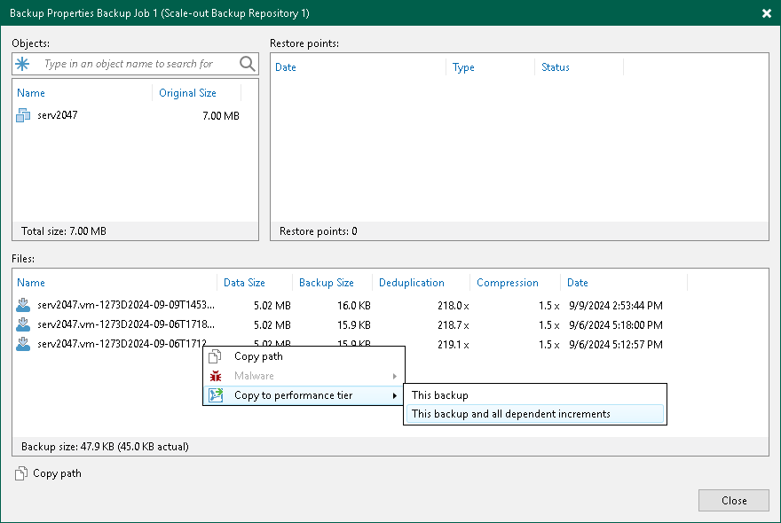
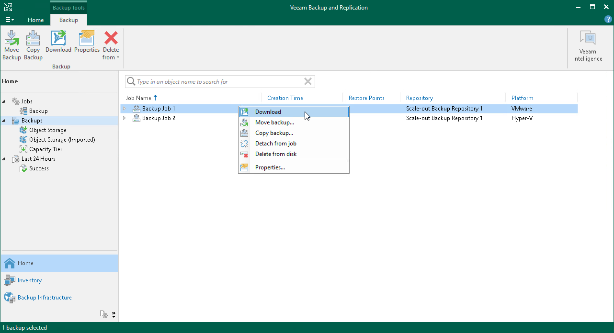

# Downloading Data from Capacity Tier

In this article

In Veeam Backup & Replication, you can manually download offloaded backups back to the performance extents. You can download one backup at a time using the Copy to Performance Tier option, or get all offloaded backups in bulk using the Download feature.

For more information, see [How Downloading from Capacity Tier Works](capacity_tier_download.md).

|  |
| --- |
| Note |
| Veeam Backup & Replication uses the [Fast Clone](backup_repository_block_cloning.md) technology only if you download all offloaded backups back to the performance extents using the Download option. Fast Clone is not supported for the Copy to Performance Tier option. |

Downloading Single Backup Chain

To download previously offloaded backup data back to the performance extents, one backup at a time, do the following:

1. Open the Home view.
2. In the [inventory pane](vbr_ui.md), select the Backups or Backups > Capacity Tier node.
3. In the working area, right-click a backup job and select Properties.
4. In the Properties window, right-click an offloaded backup file and select Copy to performance tier.

Alternatively, you can use the Copy to performance tier control at the bottom.

1. Select one of the following options:

* For VIB/VBK backup files:

* This backup and all dependent increments — to copy the selected backup along with its increments.

* For VBK backup files:

* This backup — to copy the full backup only.
* This backup and all dependent increments — to copy the selected backup along with its increments.

|  |
| --- |
| Note |
| To remove copied blocks from the performance extents, use the Move to capacity tier option, as described in section [Manually Moving Backups to Capacity Tier](moving_to_capacity_tier.md). |

Downloading All Backups

To download all offloaded backups back to the performance extents, do the following:

1. Open the Home view.
2. In the [inventory pane](vbr_ui.md), select the Backups node and select a backup job.
3. On the ribbon, click Download or in the working area, right-click a backup job and select Download.

* If the latest backup chain is already present on your performance extent, you will be asked if you wish to download all other backup files. Click Yes if you wish to do so or No to cancel the download.
* If the latest backup chain is not on your performance extent yet, you will be asked which backup files you want to download. Click All Backups to download all backup files or Latest Only to download just the latest backup chain.

|  |
| --- |
| Note |
| To remove downloaded data from the performance extents, use the Move to capacity tier option, as described in section [Manually Moving Backups to Capacity Tier](moving_to_capacity_tier.md). |

In This Section

[How Downloading from Capacity Tier Works](capacity_tier_download.md)

Related Topics

* [Backup Chain Detection](capacity_tier_inactive_backup_chain.md)
* [Viewing Capacity Tier Sessions Statistics](offload_session_results.md)

Page updated 10/2/2024

Page content applies to build 13.0.1.1071
