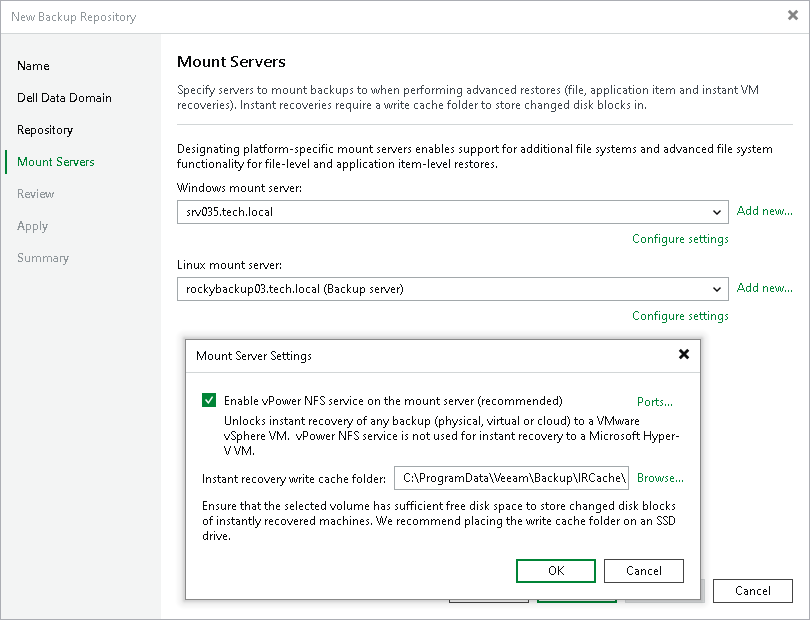

# Step 5. Specify Mount Server Settings

At the Mount Server step of the wizard, specify settings for the mount servers that you plan to use for file-level and application items restore.

The Microsoft Windows-based mount server is used for recovering data of Microsoft Windows workloads. The Linux-based mount server is used for recovering data of Linux workloads. During the restore process, Veeam Backup & Replication mounts the VM disks from the backup file residing in the backup repository to the mount server. As a result, data does not have to travel over the network, which reduces the load on the network and speeds up the restore process. For more information, see [Mount Servers](mount_server.md).

To configure the mount servers:

1. From the Windows\Linux mount server list, select a server that you want to use as a mount server.

Each list contains servers with the selected Guest OS and added to the backup infrastructure. If a server is not added to the backup infrastructure, click Add New on the right to open the wizard. For more information, see [Adding Microsoft Windows Servers](add_windows_server.md) and [Adding Linux Servers](add_linux_server.md).

1. To configure mount server settings, click Configure settings.

1. In the Mount Server Settings window, click the Enable vPower NFS service on the mount server check box. Veeam Backup & Replication will enable the vPower NFS Service on the selected mount server. This setting is used for VMware vSphere environments.
2. To customize network ports used by the vPower NFS Service, click Ports. For information on ports used by default, see [Ports](used_ports.md).
3. In the Instant recovery write cache folder field, specify a folder that will be used for writing cache during mount operations.

1. Perform the same configuration for the Linux-based mount server.

|  |
| --- |
| Important |
| Do not enable Microsoft Windows NFS services on the machine where you install the Veeam vPower NFS Service. If Microsoft NFS services and Veeam vPower NFS Service are enabled on the same machine, both services may fail to work correctly. |

