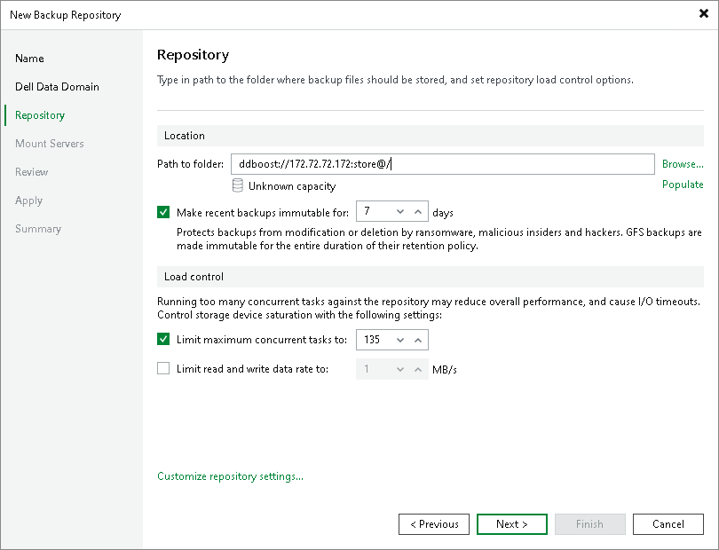
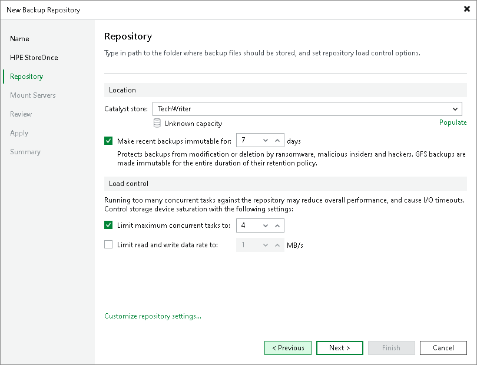
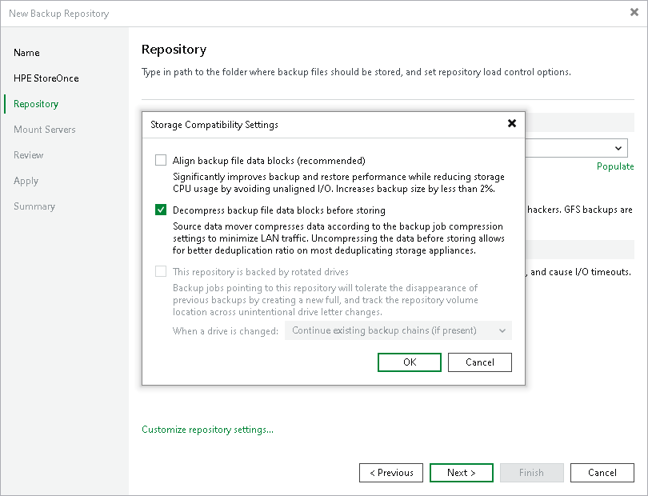

# Step 4. Configure Backup Repository Settings

At the Repository step of the wizard, configure general repository settings including path to the repository folder and load control, and also advanced repository settings.

Configuring General Repository Settings

To configure general repository settings:

1. In the Location section, specify a path to the folder where backup files must be stored. Click Populate to check capacity and available free space in the selected location.

1. [For HPE StoreOnce or Dell Data Domain with immutability] To prohibit deletion of blocks of data from the backup repository, select the Make recent backups immutable for check box and specify the immutability period. For more information on limitations and considerations for HPE StoreOnce with immutability, see [HPE StoreOnce and Immutability](deduplicating_appliance_storeonce.md#immutability). For more information on limitations and considerations for Dell Data Domain with immutability, see [Dell Data Domain](dell_dd.md#immutability).

1. [For ExaGrid, Quantum DXi, Fujitsu ETERNUS CS800 and Infinidat InfiniGuard] The Use fast cloning on XFS volumes check box is enabled and cannot be changed. This enables the copy-on-write functionality. In terms of Veeam Backup & Replication, this functionality is known as Fast Clone. For more information, see [Fast Clone](backup_repository_block_cloning.md).

1. Use the Load control section to limit the number of concurrent tasks and data ingestion rate for the backup repository. These settings will help you control the load on the backup repository and prevent possible timeouts of storage I/O operations.

   * Select the Limit maximum concurrent tasks check box and specify the maximum allowed number of concurrent tasks for the backup repository. If this value is exceeded, Veeam Backup & Replication will not start a new task until one of current tasks finishes. For more information, see [Limiting the Number of Concurrent Tasks](limiting_tasks.md).

   |  |
   | --- |
   | Note |
   | Consider the following:  * Limitation of concurrent tasks is ignored if the backup repository acts as a target storage for a Veeam Cloud Connect job. * If you use backup repositories with per-machine backup chains, it is recommended to select the Limit maximum concurrent tasks to N check box. This option reduces the number of parallel operations performed by synthetic operations (synthetic full backup, backup files merge and transformation). Otherwise, the load on the backup repository may be high. |

   * Select the Limit read and write data rate to check box and specify the maximum rate to restrict the total speed of reading and writing data to the backup repository disk. For more information, see [Limitation of Read and Write Data Rates for Backup Repositories](limiting_ingestion.md).

   |  |
   | --- |
   | Note |
   | The Limit read and write data rate to setting does not apply to health checks performed as part of backup and backup copy jobs. Even if you limit read/write rate for a backup repository, the health check will consume resources of the backup repository regardless of this setting. Consider this limitation when configuring basic and health check schedules for backup and backup copy jobs. |

Configuring Advanced Repository Settings

To configure advanced repository settings:

1. Click Advanced.
2. Use the Align backup file data blocks option to align VM data saved to a backup file at a 4 KB block boundary. The value of the setting depends on the type of backup repository you are adding. For more information, see [Preconfigured Advanced Settings](#preconfigured_advanced).
3. To overcome poor deduplication ratios during writing compressed data, select the Decompress backup data blocks before storing check box. In this case, if data compression is enabled for a job, Veeam Backup & Replication compresses data on the source side, transport it to the target side, decompress data on the target side and write raw data to the storage device to achieve a higher deduplication ratio.

|  |
| --- |
| Note |
| Veeam Backup & Replication does not compress VM data if encryption is enabled for a job and the Decompress backup data blocks before storing check box is selected in the settings of the target backup repository. Therefore, in the job statistics, you may observe a higher amount of transferred data (the Transferred counter) as compared to a job for which encryption is disabled. For more information on job statistics, see [Viewing Real-Time Statistics](realtime_statistics.md).  In the properties of the encrypted backup, you may also see that the backup size (the Backup Size column) is larger than the original VM size (the Original Size column). For more information on backup properties, see [Viewing Backup Properties](view_backup_properties.md). |

1. Deduplicating storage appliances do not support rotated drives. The This repository is backed by rotated hard drives check box is disabled for all types of deduplicating storage appliances.

Preconfigured Advanced Settings

Depending on the type of deduplicating storage appliance you use, Veeam Backup & Replication automatically sets advanced settings as described in the following sections. Deduplicating storage appliances added in Veeam Backup & Replication version 13 create a separate backup file for every workload in the job.

Dell Data Domain

* The Align backup file data blocks option is disabled and cannot be changed.
* The Decompress backup data blocks before storing option is enabled.
* The This repository is backed by rotated hard drives option is disabled and cannot be changed.

ExaGrid

* When the Use fast cloning on XFS volumes option is enabled, the Align backup file data blocks option is enabled and cannot be changed.

When the Use fast cloning on XFS volumes option is disabled, the Align backup file data blocks option is disabled and must not be changed.

* The Decompress backup data blocks before storing option is enabled.
* The This repository is backed by rotated hard drives option is disabled and cannot be changed.
* Limit max concurrent tasks is equal to 10 (recommended).

Quantum DXi

* The Align backup file data blocks option is disabled and must not be changed.
* The Decompress backup data blocks before storing option is enabled.
* The This repository is backed by rotated hard drives option is disabled and cannot be changed.

Fujitsu ETERNUS CS800

* The Align backup file data blocks option is enabled.
* The Decompress backup data blocks before storing option is enabled.
* The This repository is backed by rotated hard drives option is disabled and cannot be changed.

Infinidat InfiniGuard

* The Align backup file data blocks option is enabled.
* The Decompress backup data blocks before storing option is enabled.
* The This repository is backed by rotated hard drives option is disabled and cannot be changed.

HPE StoreOnce

* The Align backup file data blocks option is enabled and cannot be changed if Enforce fixed block chunking is enabled on the HPE StoreOnce. In other cases, the option is disabled and must not be changed.
* The Decompress backup data blocks before storing option is enabled.
* The This repository is backed by rotated hard drives option is disabled and cannot be changed.

