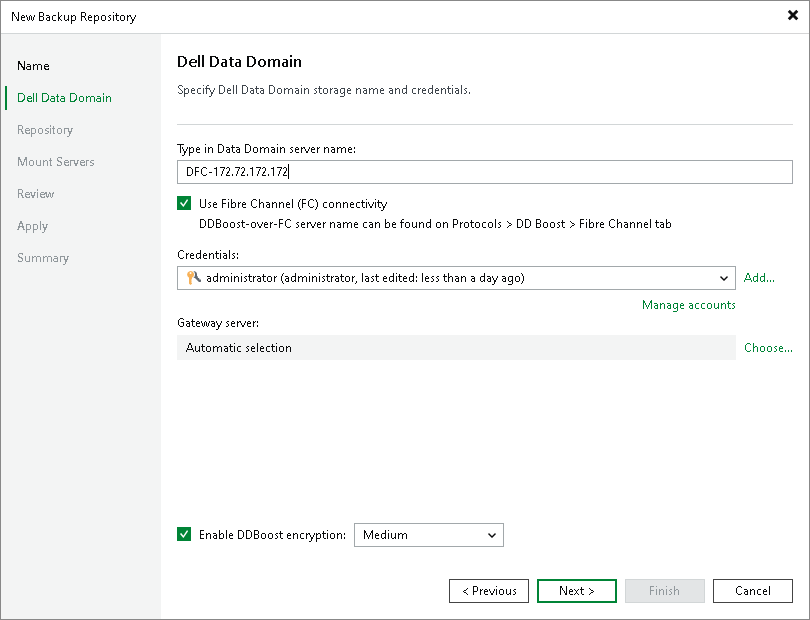
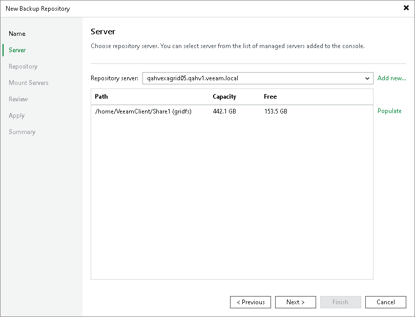
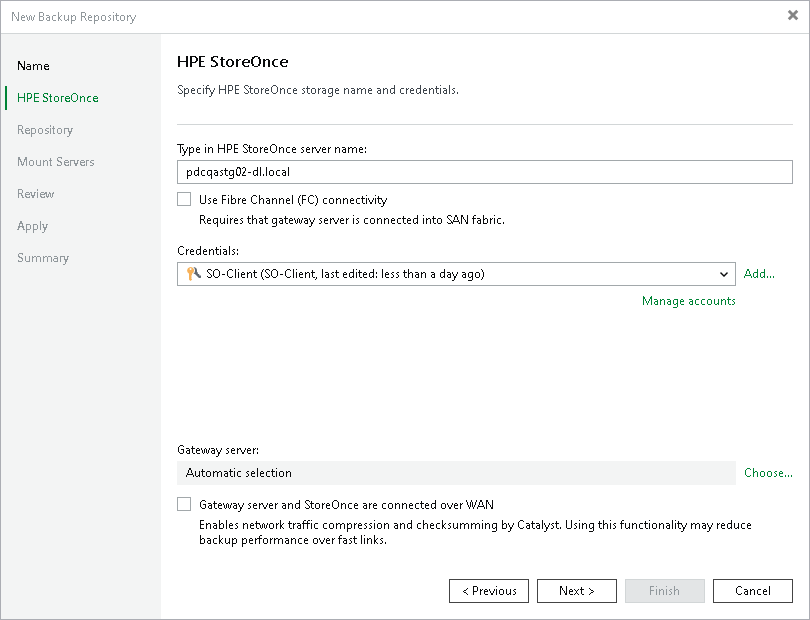

# Step 3. Specify Server Settings

In this article

Options that you can specify at the Server step of the wizard depend on the type of backup repository you are adding.

Dell Data Domain

To configure settings for Dell Data Domain:

1. Specify connection settings for Dell Data Domain:

* If Dell Data Domain works over TCP, in the Type in Data Domain server name field enter a full DNS name, or IPv4 or IPv6 address of the Dell Data Domain server. Note that you can use IPv6 addresses only if IPv6 communication is enabled as described in section [IPv6 Support](ipv6.md).
* If Dell Data Domain works over Fibre Channel, select the Use Fibre Channel (FC) connectivity check box. In the Type in Data Domain server name field, enter a name of the Data Domain Fibre Channel server. To get the Data Domain Fibre Channel server name, in Data Domain System Manager open the Data Management > DD Boost > Fibre Channel tab.

1. In the Credentials field, specify credentials of the user account to connect to the Dell Data Domain server or Dell Data Domain Fibre Channel server. The user must have permissions described in section [Permissions](required_permissions.md).

If you have not set up credentials beforehand, click the Manage accounts link at the bottom of the list or click Add on the right to add the credentials. For more information, see [Credentials Manager](credentials_manager.md).

1. To use in-flight encryption between the backup proxy and Dell Data Domain, select the Enable DDBoost encryption check box and choose the encryption level — Medium or High.
2. In the Gateway server field, specify which gateway server you want to use:

* If you want Veeam Backup & Replication to select a gateway server automatically, leave Automatic selection.
* If you want to select servers that can be used as gateway servers explicitly, click Choose next to the Gateway server field. In the Gateway Server window, click Use the following gateway servers only and select servers.

For more information on the gateway servers, their requirements and limitations, and how they are selected, see [Gateway Servers](gateway_server.md).

ExaGrid, Quantum DXi, Fujitsu ETERNUS CS800 and Infinidat InfiniGuard

To configure settings for ExaGrid, Quantum DXi, Fujitsu ETERNUS CS800 or Infinidat InfiniGuard deduplicating appliance:

1. From the Repository server list, select an appliance that you want to use as a backup repository. The Repository server list contains only those servers that are added to the backup infrastructure. If the server is not added to the backup infrastructure yet, you can click Add New to open the New Linux Server wizard. For more information, see [Virtualization Servers and Hosts](setup_add_server.md).
2. Click Populate to see the appliance capacity and available free space.

HPE StoreOnce Deduplicating Appliance

To configure settings for HPE StoreOnce:

1. In the Type in HPE StoreOnce server name field, enter a full DNS name, or IPv4 or IPv6 address of the HPE StoreOnce appliance. Note that you can use IPv6 addresses only if IPv6 communication is enabled as described in section [IPv6 Support](ipv6.md).
2. If HPE StoreOnce works over Fibre Channel, select the Use Fibre Channel (FC) connectivity check box.
3. In the Credentials field, specify credentials of the client account to connect to the HPE StoreOnce appliance. The account must have permissions described in section [Permissions](required_permissions.md).

If you have not set up credentials beforehand, click the Manage accounts link at the bottom of the list or click Add on the right to add the credentials. For more information, see [Credentials Manager](credentials_manager.md).

1. In the Gateway server field, specify which gateway server you want to use:

* If you want Veeam Backup & Replication to select a gateway server automatically, leave Automatic selection.
* If you want to select servers that can be used as gateway servers explicitly, click Choose next to the Gateway server field. In the Gateway Server window, click Use the following gateway servers only and select servers. The servers must have a direct access to the HPE StoreOnce appliance and must be located as close to the appliance as possible. Veeam Backup & Replication will choose the most suitable server.

For more information on the gateway servers, their requirements and limitations, and how they are selected, see [Gateway Servers](gateway_server.md).

1. If a WAN connection between the gateway server and the HPE StoreOnce appliance is weak, select the Gateway server and StoreOnce are connected over WAN check box. Veeam Backup & Replication will compress VM data transported from the gateway server to the HPE StoreOnce appliance, and calculate checksums for data blocks going from the gateway server to the HPE StoreOnce appliance.

Related Topics

[Gateway Servers](gateway_server.md)

Page updated 11/24/2025

Page content applies to build 13.0.1.1071
