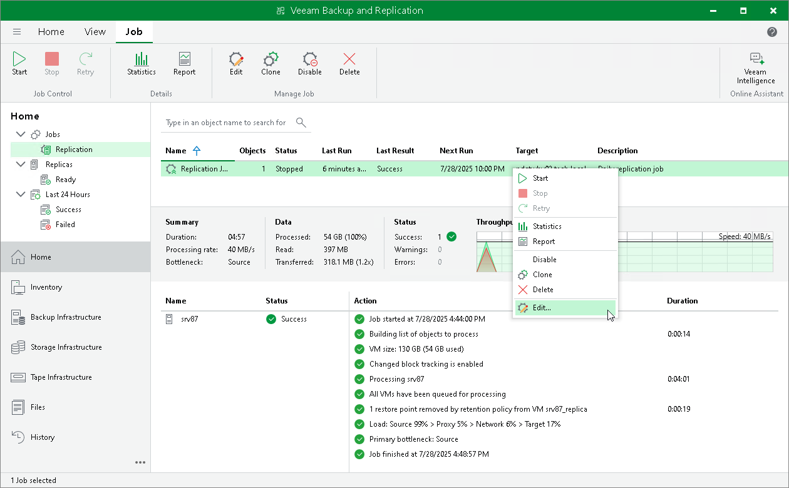

# Editing Replication Jobs

You can edit configured jobs at any moment. For example, you may want to change scheduling settings for the job or add some VMs to the job.

To edit a replication job:

1. Open the Home view.
2. In the inventory pane, navigate to the Jobs > Replication node.
3. In the working area, select the necessary replication job and select Edit on the ribbon. Alternatively, you can right-click the necessary replication job and select Edit.
4. Follow the instructions provided in [Creating Replication Jobs](replica_job.md).

|  |
| --- |
| Tip |
| If you are planning to change the repository where replica metadata is stored, first, follow the instructions provided in [this Veeam KB article](https://www.veeam.com/kb2165). |

