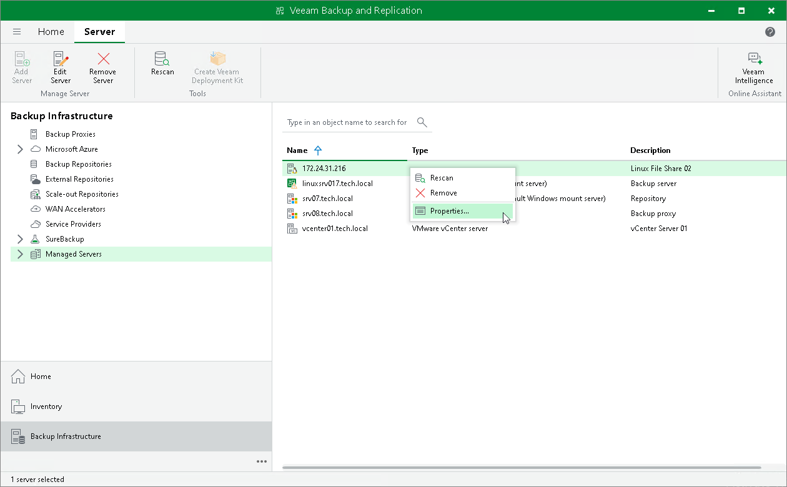

# Editing Server Settings

To edit settings of a server in the backup infrastructure:

1. Open the Backup Infrastructure view.
2. In the inventory pane, select Managed servers.
3. In the working area, select the server and click Edit Server on the ribbon or right-click the server and select Properties.
4. You will follow the same steps as you have followed when adding the server. Edit server settings as required.

