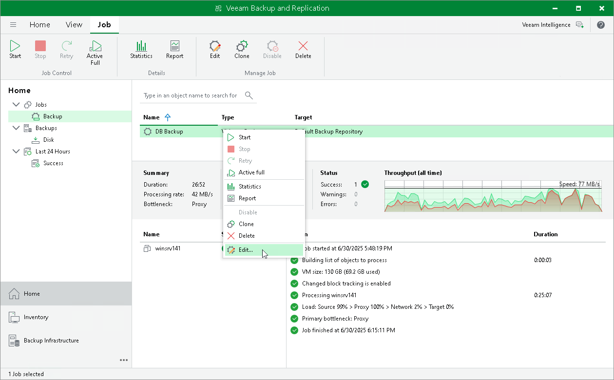

# Editing Job Settings

In this article

After you add a backup job, you can edit its settings at any time. For example, you may want to change the scheduling settings or add VMs to the job.

Editing General Settings

To edit job settings:

1. Open the Home view.
2. In the [inventory pane](vbr_ui.md), select Jobs > Backup.
3. In the working area, select the job and click Edit on the ribbon or right-click the job and select Edit.

You will follow the same steps you followed when creating the job and can change job settings as required.

Disabling GFS Scheme

If you disable the Keep certain full backups longer for archival purposes option at the Storage step of the Edit Backup Job wizard, and there are archive full backups in the target backup repository, Veeam Backup & Replication offers to remove them.

* Click Yes to remove archive full backups from the target backup repository. These backups will be removed during the next retention cycle (next backup session). The backup job will not create archive full backups.
* Click No to cancel the disable operation.

|  |
| --- |
| Note |
| If you disable the Keep certain full backups longer for archival purposes option and enable it again later, archive full backups that remained on disk will not be linked to the backup job. They will still be displayed under the Backups > Disk (Imported) node in the Veeam Backup & Replication console. |

Page updated 8/15/2025

Page content applies to build 13.0.1.1071
