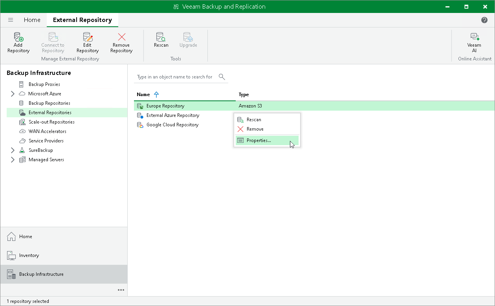

# Editing Settings of External Repositories

In this article

To edit settings of an external repository:

1. Open the Backup Infrastructure view.
2. In the inventory pane, click External Repositories.
3. In the working area, select an external repository and click Edit Repository on the ribbon or right-click the external repository and select Properties.
4. Follow the steps of the Edit External Repository wizard and edit settings as required.

Note that some settings cannot be modified and will remain disabled during editing.

|  |
| --- |
| Note |
| Veeam Backup & Replication automatically determines and sets locations for external repositories based on the datacenter region. You can check the datacenter region for each external repository at the [Bucket](external_repository_details.md) step of the Edit External Repository wizard. For more information on locations, see [Managing Locations](locations.md). |

Page updated 5/16/2024

Page content applies to build 13.0.1.1071
