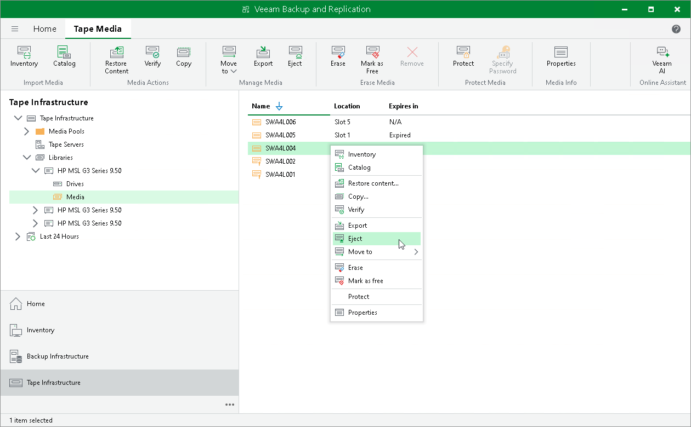
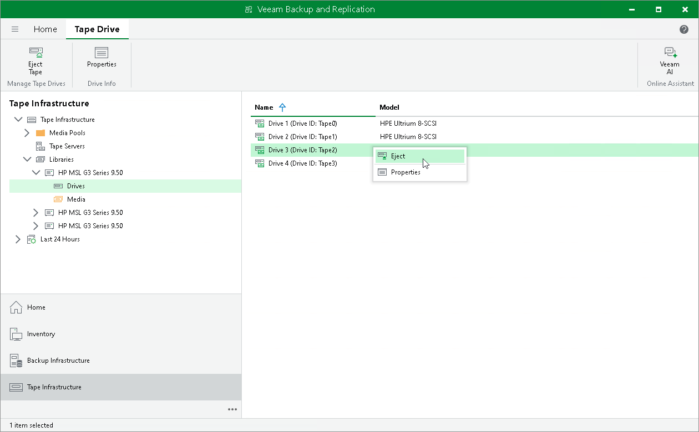

# Ejecting Tapes

Ejecting moves the tape that is currently in drive to a library slot. The tape stays in the library and is online. Ejecting prevents tapes, for example, from being occasionally overwritten.

You can eject a tape, or eject a drive. Eject command is enabled only for tapes that are in drives or for drives with loaded tapes.

To eject a tape:

1. Open the Tape Infrastructure view.
2. Navigate to the list of tapes either under Media Pools or under Libraries > LibraryName node > Media > Online.
3. Select a tape located in drive that you want to eject and click Eject on the ribbon. Alternatively, you can right-click selected tape and select Eject.

|  |
| --- |
| Note |
| If you use a tape library, Veeam Backup & Replication ejects tapes automatically after the inventory or catalog job is completed. However, this does not apply to a standalone tape drive. |

To eject a drive:

1. Open the Tape Infrastructure view.
2. Navigate to Libraries > LibraryName node > Drives.
3. Select a drive from where you want to eject the tape and click Eject on the ribbon. Alternatively, you can right-click selected tape and select Eject.

|  |
| --- |
| Tip |
| You can instruct your tape jobs to eject tape from drive after the job completes. To do so, navigate to the Options step of backup to tape job or file to tape job and select the Eject media upon job completion check box. |

