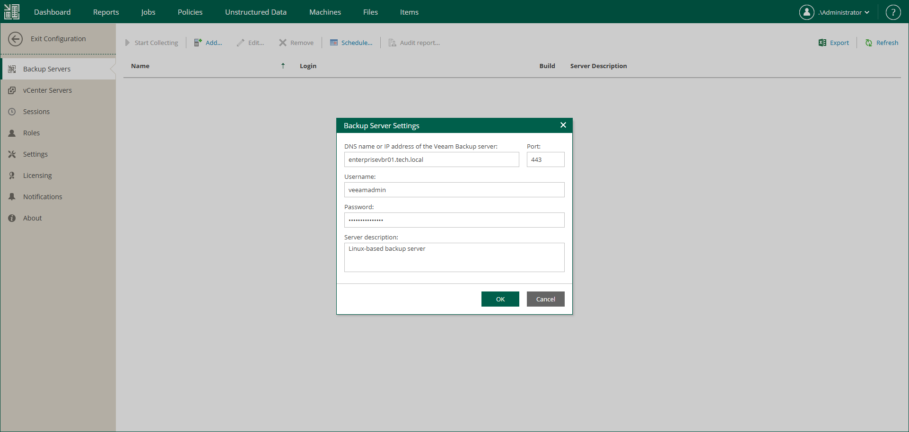

In this article

Veeam Backup Enterprise Manager allows you to manage jobs across multiple backup servers and perform recovery operations within a single application. To retrieve information about configured jobs and backup infrastructure of added backup servers, Enterprise Manager runs a data collection job. For more information, see [Collecting Data from Backup Servers](collecting_data_from_backup_servers.md).

Before You Begin

Before you add backup servers, consider the following:

* Enterprise Manager uses Kerberos authentication to communicate with backup servers. For details on Kerberos, see the [Kerberos Authentication](https://helpcenter.veeam.com/docs/vbr/userguide/kerberos_authentication.html?ver=13) section of the Veeam Backup & Replication User Guide.
* You cannot add a backup server that is running a newer version than Enterprise Manager. The Enterprise Manager version must be equal to or later than the version of any backup server you add. Before adding a backup server of a newer version, upgrade Enterprise Manager first. For details, see [Veeam Software Appliance Update](em_update_linux.md) or [Upgrading to Enterprise Manager 13.0.1](em_upgrading.md).
* Enterprise Manager supports adding backup servers running Veeam Backup & Replication 12.3 or later. When Enterprise Manager and Veeam Backup & Replication run different major or minor versions, some Enterprise Manager features may not be available:

* Enterprise Manager does not support editing jobs that are managed by backup servers of earlier major or minor versions. This includes Veeam Agent backup jobs, file backup jobs, object storage backup jobs, and backup copy jobs.
* In [Veeam Self-Service Backup Portal for Cloud Director](em_working_with_vcd_vms.md) and [vSphere Self-Service Backup Portal](em_working_with_vsphere_portal.md), you cannot create and edit jobs managed by backup servers of earlier major or minor versions.

* Data collection from backup servers of earlier major and minor versions takes more time, which can be critical if many backup servers are added to Enterprise Manager.

* To add a backup server that is part of a High Availability (HA) cluster, add it using the cluster virtual IP address or cluster full DNS name. In this case, after a node switchover, Enterprise Manager will automatically collect the data from the active node.

If a backup server that is already added to Enterprise Manager becomes part of an HA cluster, you must re-add it using the cluster virtual IP address or cluster full DNS name after assembling the cluster. If you do not re-add the backup server, Enterprise Manager will not be able to collect data from it after a node switchover. For more information on HA clusters, see the [High Availability (HA) Cluster](https://tw-preview.dev.amust.local/html/vbr/13.0.1/userguide/high_availability_cluster.html) section of the Veeam Backup & Replication User Guide.

* Do not add the same backup server to multiple instances of Enterprise Manager, as well as a backup server cloned from an already added backup server.

* Do not add a backup server that holds the same configuration database as an already added backup server, even after you remove the original backup server from Enterprise Manager.

Two backup servers may have the same configuration database if you migrate a configuration database from one backup server to another. To avoid conflicts when adding the server to Enterprise Manager, follow the steps in the [Migrating Veeam Backup & Replication to Another Backup Server](https://helpcenter.veeam.com/docs/vbr/userguide/vbr_config_migrate.html?ver=13) section of the Veeam Backup & Replication User Guide. During migration, the database will be restored with a new ID on the target backup server.

Adding Backup Server

To add a backup server to Enterprise Manager, take the following steps:

1. Log in to Enterprise Manager using an administrative account.
2. To open the Configuration view, click Configuration in the upper-right corner.
3. Select the Backup Servers section on the left of the Configuration view.
4. At the top of the Backup Servers section, click Add.
5. In the DNS name or IP address of the Veeam backup server field, enter the DNS name, IPv4 or IPv6 address of the server you want to add.

* When specifying a DNS name, ensure that Enterprise Manager can resolve it.
* If the backup server is part of a High Availability (HA) cluster, enter the cluster virtual IP address or cluster full DNS name. After a node switchover, Enterprise Manager will automatically collect the data from the active node. For more information on HA clusters, see the [High Availability (HA) Cluster](https://tw-preview.dev.amust.local/html/vbr/13.0.1/userguide/high_availability_cluster.html) section of the Veeam Backup & Replication User Guide.
* For more information on IPv6 support, see the [IPv6 Support](https://helpcenter.veeam.com/docs/vbr/userguide/ipv6.html?ver=13) section of the Veeam Backup & Replication User Guide.

1. In the Server description field, specify a description for the backup server.
2. Enter the name and password of the backup server account.

* The account must be assigned the Veeam Backup Administrator role. For more information, see [Configuring Backup Server Roles](vbr_server_roles.md).
* When adding a Linux-based backup server, use the UPN format to specify a domain user.
* [For Linux-based Enterprise Manager] If you are adding a backup server with Veeam Backup & Replication 12.3.x and you want to use an Active Directory account, specify the user name in the UPN format with a capitalized domain name (for example, user@DOMAIN).

1. Specify the port used by the Veeam Backup Service on the backup server.
2. Click OK to add the backup server.
3. In the certificate validation window, review the certificate thumbprint:

* Click Yes if you trust the server.

* Click No if you do not trust the server. Enterprise Manager will display an error message, and the connection will not be established.

Page updated 1/13/2026

Page content applies to build 13.0.1.1071
