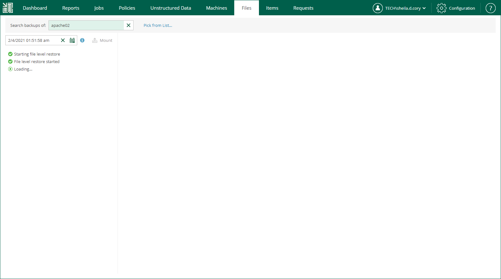
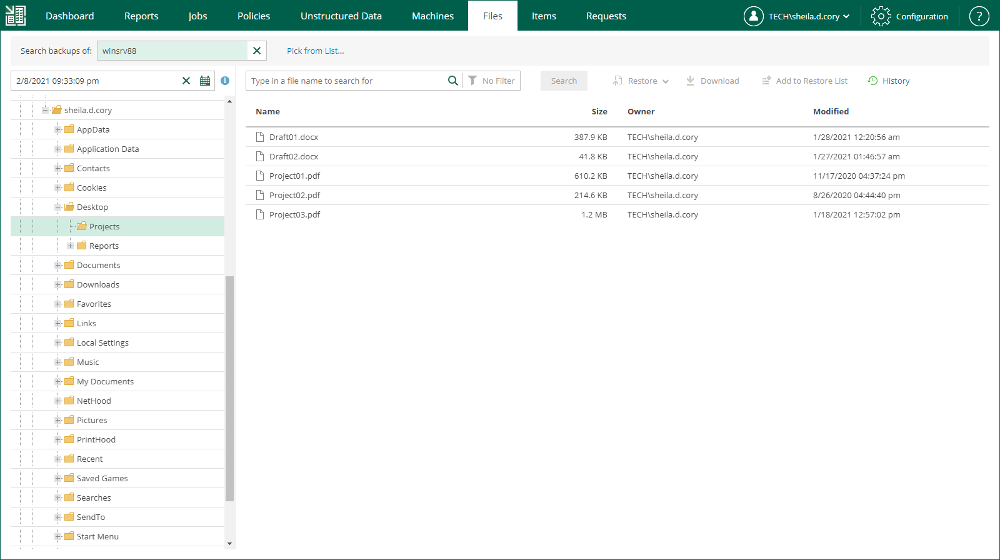

# Browsing Machine Backups for Guest OS Files

After catalog replication, you can browse any machine backup for OS guest files. Note that with the file browsing functionality, you can browse and search for files in the selected machine backup at a specific restore point only.

If you are using the Enterprise or Enterprise Plus license edition in your virtual environment, consider that Veeam Backup Enterprise Manager keeps index files for backups that are currently stored on disk, and for archived backups (for example, backups that were recorded to tape). Thus, you will be able to browse and search through backup contents even if the backup in repository is no longer available.

To browse guest OS files in a machine backup:

1. Open the Files tab.
2. In the Search backups of field, enter the name of a machine whose files you want to restore or click the Pick from List link and select the necessary machine in the Select Object window.
3. To specify a restore point from which to restore guest OS files, click the calendar icon in the restore point field and select a date and a restore point created on that date. If multiple jobs have processed the machine, a job name will be also displayed for each restore point.

You can only choose the dates when at least one restore point was created. By default, the latest restore point is selected in the restore point field.

1. If the machine has been backed up without guest indexing, click Mount. If the machine guest OS information has not been collected during the backup, you will be also prompted to specify the guest OS type. Machine disks from the backup will be mounted to Veeam backup server to present machine file system to you; wait for the process to complete.

If the machine has been backed up with guest indexing enabled, no additional operations are needed.

As a result, the file tree of the machine as of the selected backup and restore point date will be displayed. You can manually browse the file tree or use the search field to find a necessary file. Consider that depending on the number of files on the machine, the search process may take some time.

|  |
| --- |
| Important |
| For machines processed without indexing, you can only use browsing or search to find the necessary files within the selected restore point. Advanced search capabilities (including search through multiple restore points) are available only for machines processed with guest indexing enabled. |

