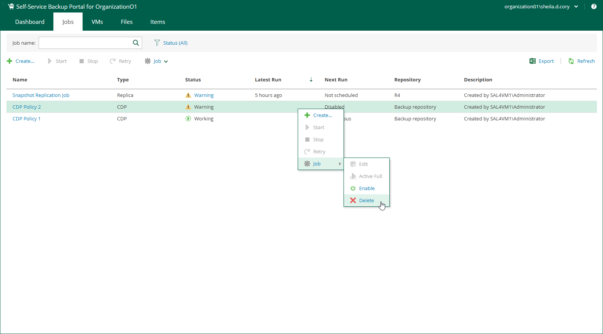

In this article

Members of a VMware Cloud Director organization can delete organization backup jobs, replication jobs and CDP policies. Deleted jobs and policies are removed and no longer appear in Veeam Self-Service Backup Portal, Veeam Backup & Replication console and in Veeam Backup Enterprise Manager.

To delete a job, do the following:

1. On the Jobs tab, select a job from the list.
2. On the toolbar, click Job > Delete.

Alternatively, you can right-click a job or policy and select Job > Delete.

1. You will be prompted to delete backup files. To delete backup files, select the Delete backup files check box and click Yes to confirm the operation.

If four-eyes authorization is enabled on the backup server, backup files will remain in the backup repository and become orphaned.

Page updated 11/26/2024

Page content applies to build 13.0.1.1071
