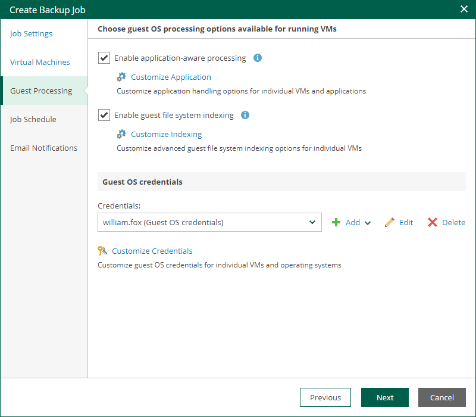

# Step 5. Configure Guest Processing Settings

At the Guest Processing step of the wizard, you can configure the following settings for VM guest OS processing:

* [Application-Aware Processing](cd_jobs_aap_settings.md)
* [Guest OS File Indexing](cd_jobs_indexing.md)
* [Guest OS Credentials](cd_jobs_guest_os_credentials.md)

|  |
| --- |
| Note |
| VMware Cloud Director system administrators can access guest OS credentials available for their organizations. They can also supply new credentials for guest OS processing. |

