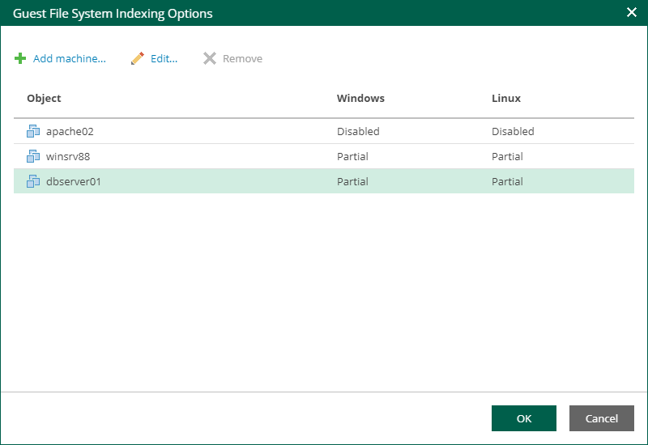
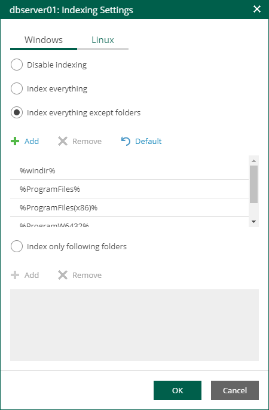

# Guest OS File Indexing

To quickly find the necessary guest OS files in backups, select the Enable guest file system indexing check box. This setting provides, in particular, advanced search capabilities when viewing guest OS files and performing 1-Click file restore using Enterprise Manager web UI. If indexing is disabled, you can only use quick search within the selected restore point.

|  |
| --- |
| Note |
| For proper file indexing of Linux machines, Veeam Backup & Replication requires several utilities to be installed on the machines: mlocate, gzip, and tar. If these utilities are not found, you are prompted to deploy them to support index creation. |

To provide granular indexing options for individual machines:

1. Click the Customize Indexing link.
2. In the Guest File System Indexing Options window, select a machine from the list and click Edit.

Consider the following:

* To customize settings of a machine added to the job as part of a container, add the machine as a standalone instance. For that, click Add Machine and choose the necessary VM. Next, select the machine from the list and click Edit to customize VM settings.
* To discard custom settings of a machine, select it from the list and click Remove.

1. In the Indexing Settings window displayed for the selected machine, go to the Windows or Linux tab and specify what files should be indexed:

* Select Disable indexing if you do not want to index guest OS files of the machine.
* Select Index everything if you want to index all guest OS files inside the machine.
* Select Index everything except folders if you want to index all guest OS files except those defined in the list. By default, system folders are excluded from indexing. You can add or delete folders to exclude using the Add and Remove buttons.
* Select Index only following folders to select specific folders that you want to index. To form the list of folders, use the Add and Remove buttons.

1. Click OK to save the settings and close the window.

