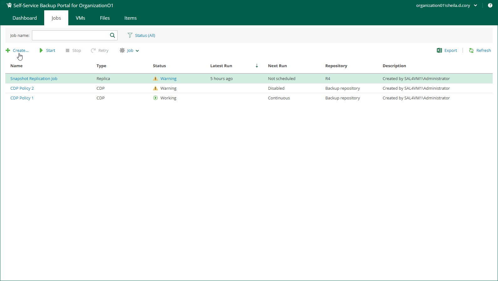

# Step 1. Launch Wizard

To launch the Create Backup Job wizard, do the following:

1. Log in to the Veeam Self-Service Backup Portal under a Cloud Director account with proper rights.

For more information on required user rights, see [Access Control](vcd_portal_permissions.md).

1. On the Jobs tab, click Create.

