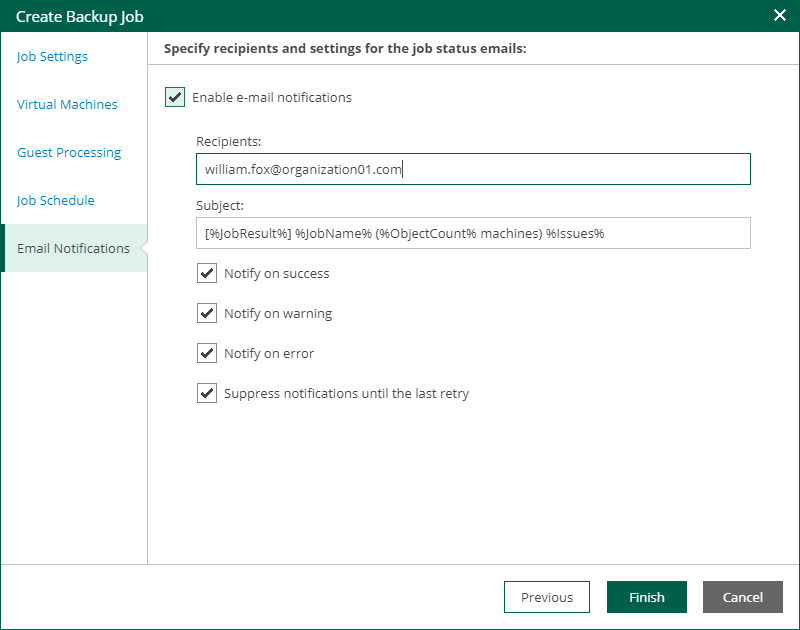

# Step 7. Configure Email Notifications

At the Email Notifications step, you can configure email notifications.

Email notifications will be sent daily if you configure global notification settings in Veeam Backup Enterprise Manager. For more information, see [Notifications on Job Results](em_notifications_on_job_results.md). If you want to receive a notification after each job run, configure notification setting for this job in Veeam Backup & Replication. For details, see the [Notification Settings](https://helpcenter.veeam.com/docs/vbr/userguide/backup_job_advanced_notify_vm.html?ver=13) section of the Veeam Backup & Replication User Guide.

To configure email notifications for this job, take the following steps:

1. Select the Enable e-mail notifications check box if you want to receive notifications about the job completion status by email.
2. In the Recipients field, specify recipient’s email address. You can enter several addresses separated by a semicolon.
3. In the Subject field, specify a notification subject. You can use the following variables in the subject: %Time% (completion time), %JobName%, %JobResult%, %ObjectCount% (number of VMs in the job) and %Issues% (number of VMs in the job that have finished with the Warning or Failed status).
4. Select Notify on success to receive an email notification when the job completes successfully.
5. Select Notify on warning to receive an email notification when the job completes with a warning.
6. Select Notify on error to receive an email notification when the job fails.
7. Select the Suppress notifications until the last retry check box to receive a notification about the final job status. If you do not enable this option, Veeam Backup & Replication will send one notification per every job retry.
8. To create the job, click Finish.

Other job settings are obtained from the job configuration specified for the organization. For more information, see [Adding Organization Configuration](em_configure_vcd_org.md).

