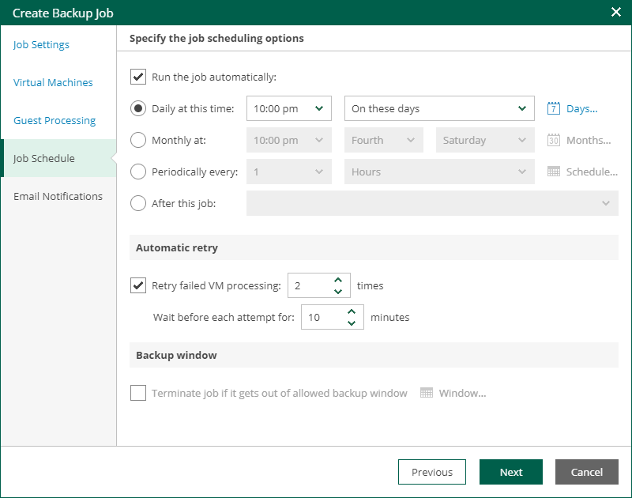
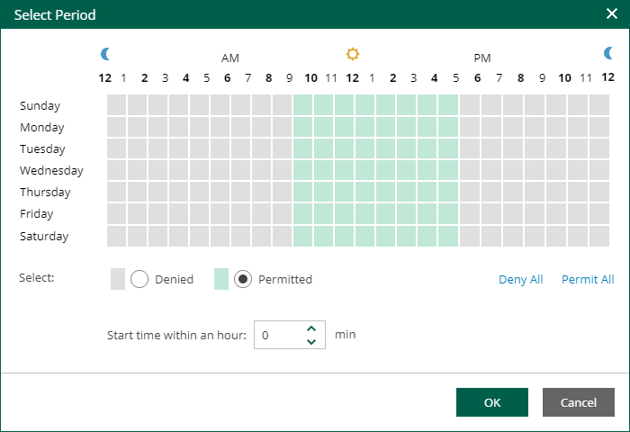

In this article

At the Job Schedule step of the wizard, you can select to run the job manually or schedule the job to run on a regular basis.

To edit the job schedule:

1. Select the Run the job automatically check box. If the check box is not selected, you will need to start the job manually.
2. Edit the scheduling settings. You can select to run the job daily, monthly, periodically with a specific time interval, continuously or after a specific job.

For more information, see [Schedule Settings](#shedule).

1. In the Automatic retry section, define whether Veeam Backup & Replication must attempt to run the backup job again if the job fails for some reason. During a job retry, Veeam Backup & Replication processes failed machines only. Enter the number of attempts to run the job and define time intervals between them. If you select continuous backup, Veeam Backup & Replication will retry the job for the defined number of times without any time intervals between the job runs.
2. In the Backup window section, edit the time interval within which the backup job must complete. The backup window prevents the job from overlapping with production hours and ensures that the job does not provide unwanted overhead on the production environment. To set up a backup window for the job:

1. Select the Terminate job if it gets out of allowed backup window check box and click Window.
2. Define the allowed hours and prohibited hours for backup. If the job exceeds the allowed window, it will be automatically terminated.

|  |
| --- |
| Note |
| If the Location property of the source object and target object do not match, you will receive a warning message after you click Finish. For example, you may have a backup job targeted at repository located in Sydney, and source machines located in London. |

Schedule Settings

If you have selected to run the job automatically, you can select one of the following options:

* To run the job at specific time daily, on defined week days or with specific periodicity, select Daily at this time. Use the fields on the right to configure the necessary schedule.
* To run the job once a month on specific days, select Monthly at this time. Use the fields on the right to configure the necessary schedule.

|  |
| --- |
| Note |
| When you configure the job schedule, keep in mind possible date and time changes (for example, related to daylight saving time transition). |

* To run the job repeatedly throughout a day with a specific time interval, select Periodically every. In the field on the right, select the necessary time unit: Hours or Minutes. Click Schedule and use the time table to define the permitted time window for the job. In the Start time within an hour field, specify the exact time when the job must start.

A repeatedly run job is started by the following rules:

* Veeam Backup & Replication always starts counting defined intervals from 12:00 AM. For example, if you configure to run a job with a 4-hour interval, the job will start at 12:00 AM, 4:00 AM, 8:00 AM, 12:00 PM, 4:00 PM and so on.
* If you define permitted hours for the job, after the denied interval is over, Veeam Backup & Replication will immediately start the job and then run the job by the defined schedule.

For example, you have configured a job to run with a 2-hour interval and defined permitted hours from 9:00 AM to 5:00 PM. According to the rules above, the job will first run at 9:00 AM, when the denied period is over. After that, the job will run at 10:00 AM, 12:00 PM, 2:00 PM and 4:00 PM.

* To run the job continuously, select the Periodically every option and choose Continuously from the drop-down list on the right. A new backup job session will start as soon as the previous backup job session finishes.
  + To chain jobs, use the After this job field. In the common practice, jobs start one after another: when job A finishes, job B starts and so on. If you want to create a chain of jobs, you must define the time schedule for the first job in the chain. For the rest of the jobs in the chain, select the After this job option and choose the preceding job from the list. If you start the first job manually, Veeam Backup Enterprise Manager will display a notification. You will be able to choose whether to start the chained job as well.

Page updated 9/4/2025

Page content applies to build 13.0.1.1071
