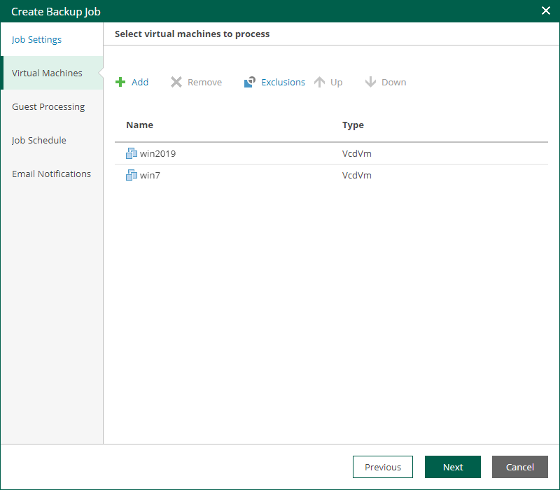

In this article

At the Virtual Machines step of the wizard, you can add or remove VMs, vApps and VDCs of the organization. Jobs with VM containers are dynamic in their nature: if a new machine is added to the container after the job is created, the job is automatically updated to include the added machine.

Adding VMs and VM containers

To add a VM or a VM container:

1. Click the Add.

1. In the virtual infrastructure tree, select the necessary VMs or VM containers.

If you select a VM container and later add a new VM to the container, Veeam Backup & Replication will update job settings automatically to include the VM.

|  |
| --- |
| Tip |
| To quickly find the necessary objects, you can do the following:   * Search for objects: type a name or part of a name in the search field. Specify the type of the object from a scroll list next to the search field. * Switch between virtual infrastructure views using the buttons in the upper-right corner. For VMware objects, you can switch between the Hosts and Clusters, VMs and Templates, Datastores and VMs, and Tags and VMs views. |

1. Click OK to save the changes.

Removing VMs and VM containers

To remove a VM or VM container, select it in the list and click Remove.

Excluding VMs

You can also exclude individual VMs from VM containers.

To exclude VMs from a VM container:

1. Select a VM container in the list and click Exclusions.
2. In the Exclusions window, click Add and select machines that you want to exclude.

Page updated 10/30/2025

Page content applies to build 13.0.1.1071
