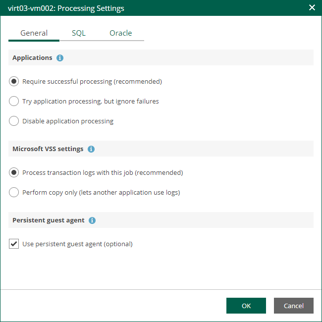
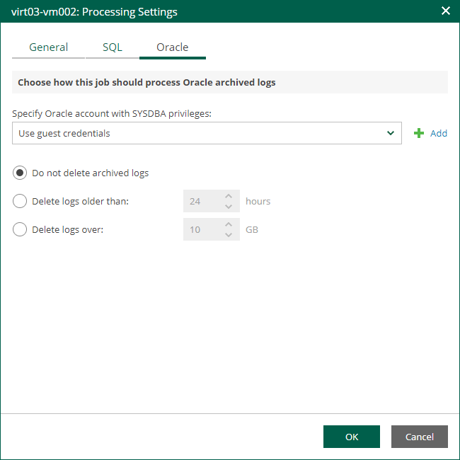

# Oracle Archived Log Settings

If you replicate a VM where Oracle Database is deployed, you can specify how Veeam Backup & Replication must process archived redo logs on this VM.

1. At the Guest Processing step of the wizard, make sure the Enable application-aware processing check box is selected.
2. Click the Customize Application link.
3. In the displayed window, select the Oracle VM from the list and click Edit.
4. On the General tab of the VM Processing Settings window, make sure the following options are selected:

* In the Applications section, either the Require successful processing or Try application processing, but ignore failures option must be selected.
* In the Transaction logs processing section, the Process transaction logs with this job option must be selected.

1. On the Oracle tab of the VM Processing Settings window, specify log processing settings.

1. Specify a user account that will connect to the Oracle database.

* Select Use guest credentials to use the account specified at the Guest Processing step of the wizard to access the VM guest OS and connect to the Oracle database.
* Specify another account. To do this, select the necessary account from the drop-down list or click Add and add a new account.

Make sure the specified account has sufficient rights. For details, see the [Permissions](https://helpcenter.veeam.com/docs/vbr/userguide/veo_permissions.html?ver=13) section of the Veeam Explorers User Guide.

1. Specify how Veeam Backup & Replication must process archived redo logs on the Oracle VM.

* Select Do not delete archived logs to preserve archived redo logs on the original Oracle server.

Select this option for databases in the NOARCHIVELOG mode. If the database is in the ARCHIVELOG mode, archived logs on the VM guest OS may grow large and consume all disk space. In this case, database administrators must take care of archived logs themselves.

* Select Delete logs older than <N> hours / Delete logs over <N> GB to delete archived logs that are older than <N> hours or larger than <N> GB. The log size threshold refers not to the total size of all logs for all databases, but to the log size of each database on the selected Oracle VM.

Transaction logs will be deleted using Oracle Call Interface after the CDP policy creates a long-term restore point. If the creation fails, the logs will remain untouched until the next start of the long-term restore point creation.

