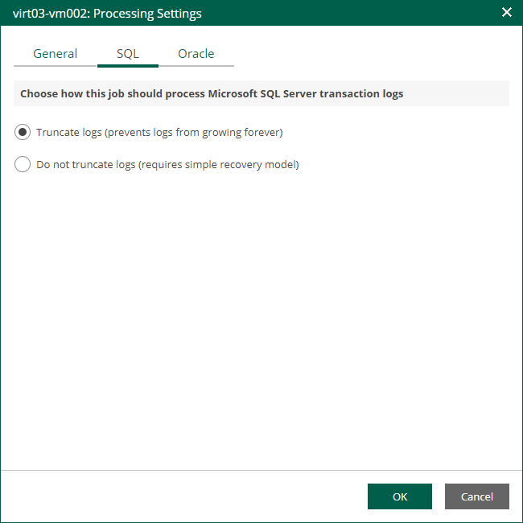

In this article

If you replicate a Microsoft SQL Server VM, you can specify how Veeam Backup & Replication must process transaction logs on this VM.

1. At the Guest Processing step of the wizard, make sure the Enable application-aware processing check box is selected.
2. Click the Customize Application link.
3. In the displayed window, select the Microsoft SQL Server VM from the list and click Edit.
4. On the General tab of the VM Processing Settings window, make sure the following options are selected:

* In the Applications section, either the Require successful processing or Try application processing, but ignore failures option must be selected.
* In the Transaction logs processing section, the Process transaction logs with this job option must be selected.

1. Open the SQL tab of the VM Processing Settings window.
2. Specify how Veeam Backup & Replication will process Microsoft SQL Server transaction logs.

* Select Truncate logs to truncate transaction logs after the CDP policy creates a long-term restore point.

In this case, transaction logs will be truncated after the CDP policy creates a long-term restore point. If the creation fails, the logs will remain untouched until the next start of the long-term restore point creation.

* Select Do not truncate logs to preserve transaction logs.

This option is recommended if you use another tool to perform VM guest-level replication, and this tool maintains consistency of the database state.

Page updated 9/4/2025

Page content applies to build 13.0.1.1071
