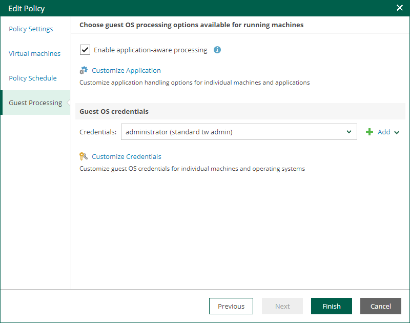

In this article

At the Guest Processing step of the wizard, you can select to create a transactionally consistent replicas, configure transaction log handling settings, and enable guest file system indexing.

In This Section

* [Application-Aware Processing](cdp_edit_aap_settings.md)
* [Guest OS Credentials](cdp_edit_guest_os_credentials.md)

Page updated 9/4/2025

Page content applies to build 13.0.1.1071
