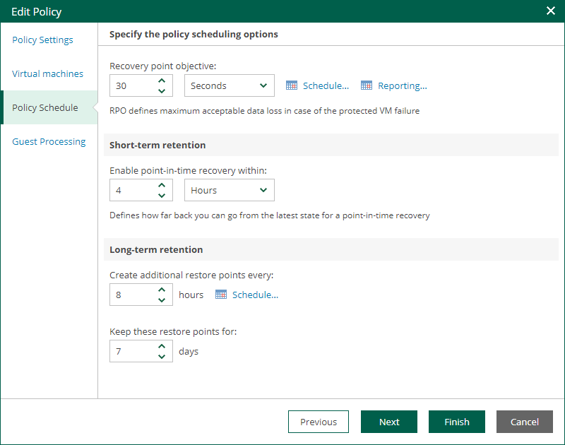
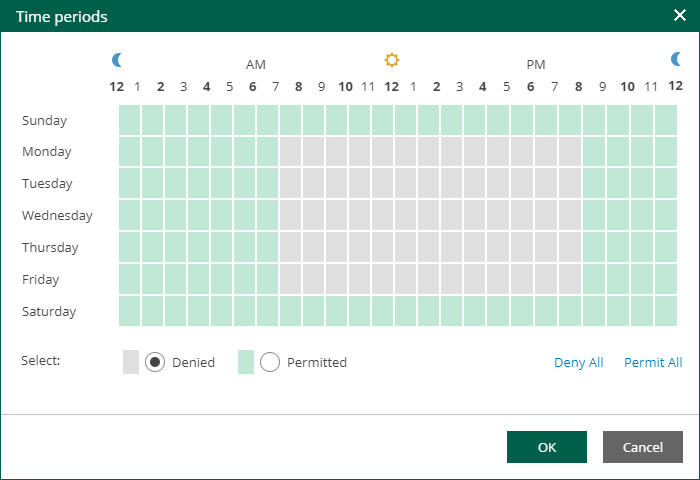
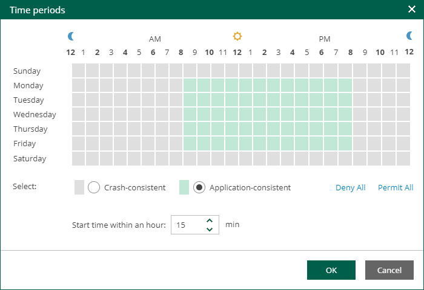

# Step 4. Edit Policy Schedule

At the Policy Schedule step of the wizard, you can edit schedule and retention settings:

1. Configure scheduling settings:

1. In the Recovery point objective section, specify an RPO in seconds or minutes. You can select the period from 2 seconds to 60 minutes.

During every specified period, Veeam Backup & Replication will create short-term restore points for VM replicas and send these restore points to the target destination. Note that short-term restore points are crash-consistent.

1. To specify permitted and denied hours for the policy run, click Schedule on the right and use the timetable.

1. To instruct the CDP policy to display a warning or error if a newly created replicated states are not transferred to the target within the set RPO, click Reporting. Then specify when the policy must display errors and warnings.

If you have configured email notification settings, Veeam Backup & Replication will mark the policy with the Warning or Error status and will also send email notifications.

1. In the Short-term retention section, specify how long you want to store a short-term restore point. The maximum value is 7 days. Note that the total size of the log files that store incremental changes is a maximum of 2 TB per VM disk.
2. In the Long-term retention section, configure when to create long-term restore points and for how long to store them:

1. In the Create additional restore points every field, specify how often you want to create long-term restore points.
2. In the Keep restore points for field, specify for how long to store these long-term restore points.
3. To specify time periods when Veeam Backup & Replication must create application-consistent and crash-consistent long-term restore points, click VSS. In the Time periods window, select the necessary time area and click Crash-consistent or Application-consistent. By default, Veeam Backup & Replication creates application-consistent backups if you enable [application-aware processing](cdp_edit_aap_settings.md). If you do not enable application-aware processing, Veeam Backup & Replication will create crash-consistent long-term restore points.

To shift the schedule, specify the offset in the Start time within an hour field. For example, you schedule creation of crash-consistent restore points from 00:00 to 01:00, and set the offset value to 25. The schedule will be shifted forward, and the crash-consistent restore points will be created from 0:25 and to 01:25.

