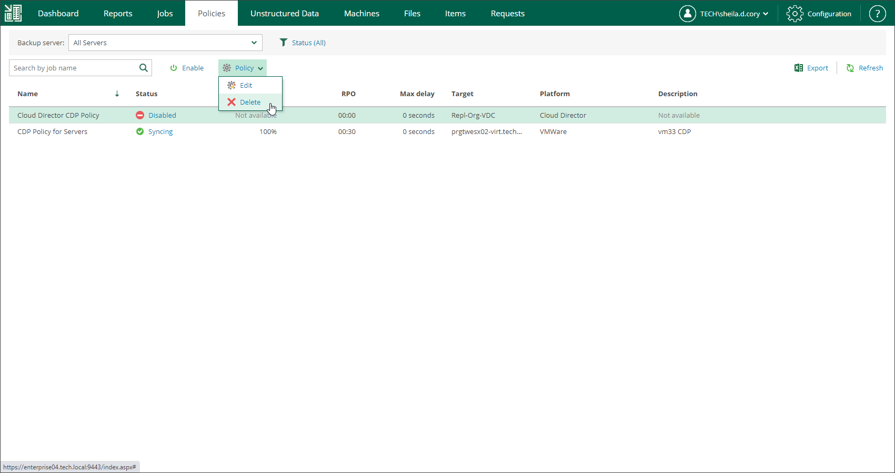

# Deleting Policies

Users with the Portal Administrator role can permanently delete CDP policies. The deleted policies will no longer appear in the UI. They are removed from the Enterprise Manager database and from the Veeam Backup configuration database on the backup server.

Before you delete a CDP policy, you must disable it.

To delete a policy:

1. On the Policies tab, select the required policy in the list.
2. On the toolbar, click Policy and select Delete.

1. In the displayed window, click Yes to confirm the operation.

