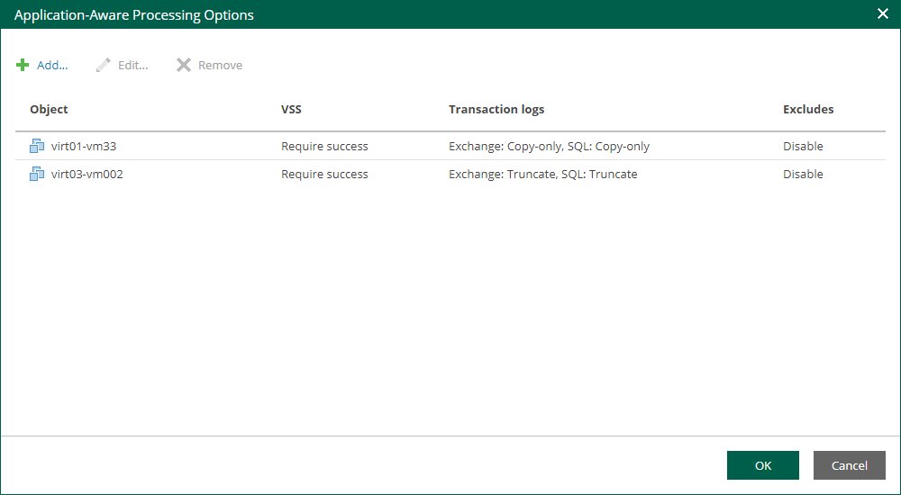

In this article

If VMs run Microsoft Active Directory, Microsoft SQL Server, Microsoft SharePoint, Microsoft Exchange, or Oracle, you can enable application-aware processing to create transactionally consistent replicas. The transactionally consistent replicas guarantee proper recovery of applications without data loss.

To configure application-aware processing:

1. Select the Enable application-aware processing check box.
2. Click the Customize Application link.
3. To define custom settings for a machine in the list, select it and click Edit.

Consider the following:

* To customize settings of a machine added as part of a container, add the machine as a standalone instance. For that, click Add machine and choose the necessary VM. Next, select the machine from the list and click Edit to customize VM settings.
* To discard custom settings of a machine, select the machine in the list and click Remove.

1. Configure the necessary settings for the selected application server:

* [General Settings](cdp_aap_general.md)
* [Microsoft SQL Server Transaction Log Settings](cdp_aap_sql.md)
* [Oracle Archived Log Settings](cdp_aap_oracle.md)

Page updated 9/4/2025

Page content applies to build 13.0.1.1071
