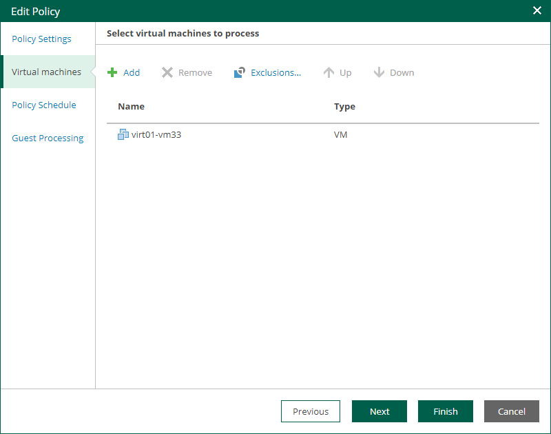

In this article

At the Virtual Machines step of the wizard, you can add or remove individual VMs or VM containers (for example, hosts or folders). You can also exclude individual VMs from VM containers, for example, if you need to replicate an entire VMware vSphere server except some machines running on this server.

|  |
| --- |
| Note |
| For VMware Cloud Director CDP policies, you cannot add single VMs. You can manage only vApps and other Cloud Director containers. The scope depends on your Cloud Director access rights. |

Adding VMs and VM containers

To add a VM or VM container:

1. Click Add.

1. In the virtual infrastructure tree, select the necessary VMs or VM containers.

If you select a VM container and later add a new VM to the container, Veeam Backup & Replication will update policy settings automatically to include the VM.

|  |
| --- |
| Tip |
| To quickly find the necessary objects, you can do the following:   * Search for objects: type a name or part of a name in the search field. Specify the type of the object from a scroll list next to the search field. * Switch between virtual infrastructure views using the buttons in the upper-right corner: Hosts and Clusters, VMs and Templates, Datastores and VMs and Tags and VMs. |

1. Click OK to save the changes.

Removing VMs and VM containers

To remove a VM or VM container, select it in the list and click Remove.

Excluding VMs from VM containers

To exclude VMs from a VM container:

1. Select a VM container in the list and click Exclusions.
2. In the Exclusions window, click Add and select machines that you want to exclude.

Changing Object Processing Order

If specific objects must be processed first, you can change the object processing order. The object processing order can be helpful if you want to ensure that processing of an object does not overlap with other scheduled activities, or that it is completed before the certain time.

To change the processing order, select the necessary objects and move them up or down the list using the Up and Down buttons on the right.

|  |
| --- |
| Note |
| * VMs inside a VM container are processed at random. To ensure that VMs are processed in the defined order, add them as standalone VMs, not as a part of containers. * The processing order may differ from the order that you have defined. For example, if resources of a VM that is higher in the priority are not available, and resources of a VM that is lower in the priority are available, the VM with the lower priority will be processed first. |

Page updated 10/30/2025

Page content applies to build 13.0.1.1071
