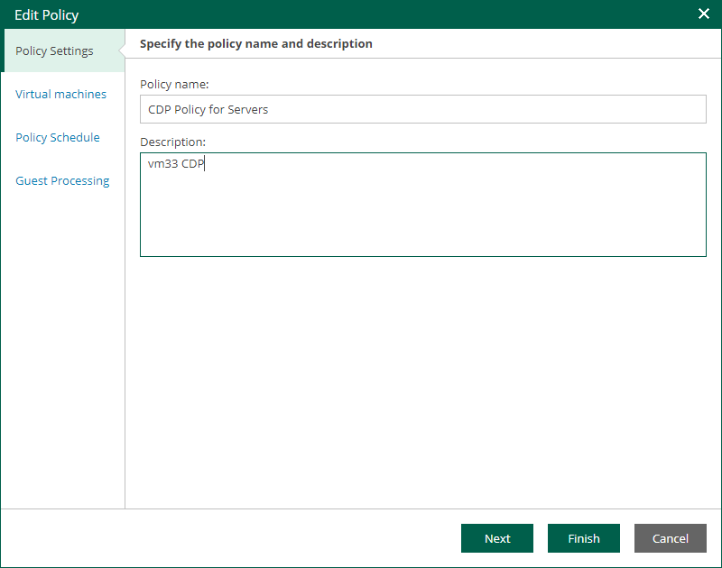

# Step 2. Edit Policy Name and Description

At the Policy Settings step of the wizard, you can modify the name and description of the selected CDP policy:

1. In the Policy name field, specify a name for the policy.
2. In the Description field, provide an optional description for future reference.

