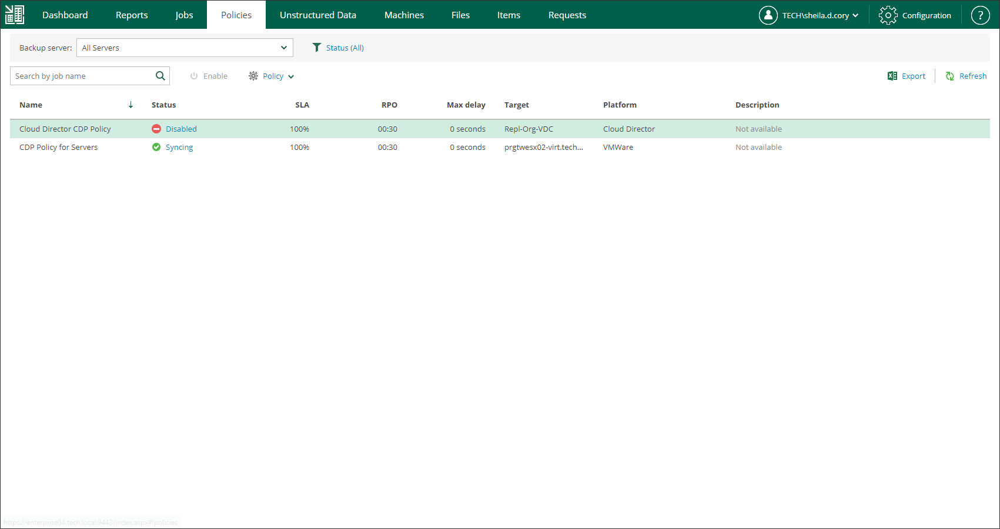

In this article

Users with the Portal Administrator role can enable and disable CDP policies. Disabled CDP policies are temporary paused.

To enable or disable a policy:

1. On the Policies tab, select a policy from the list.
2. On the toolbar, click Enable or Disable.

Page updated 9/2/2025

Page content applies to build 13.0.1.1071
