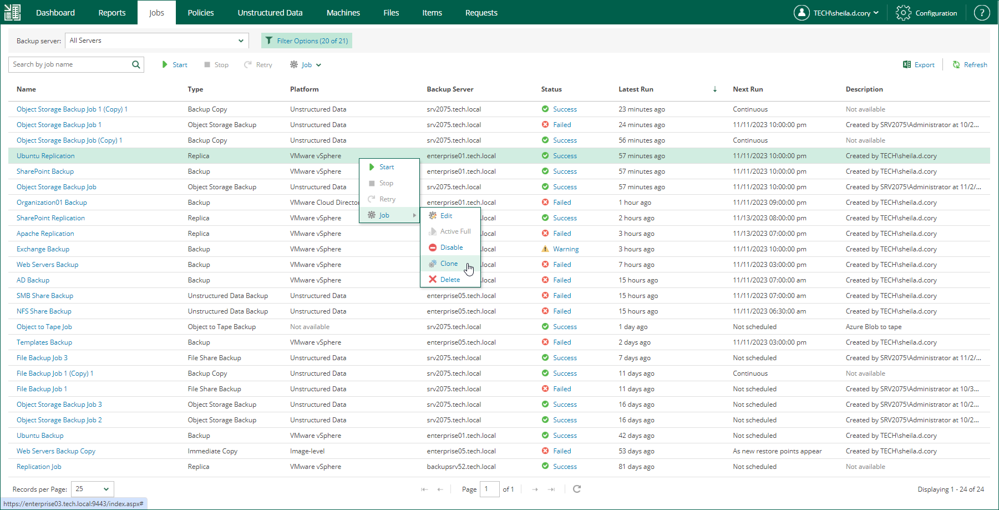

# Cloning Jobs

In addition to performing job editing tasks, you can add new jobs by means of job cloning. Job cloning allows you to create an exact copy of any backup or replication job available in the job list. The recommended practice is to configure a set of ‘job templates’ in advance, using the Veeam Backup & Replication console on every managed Veeam backup server. These job templates can be used by Enterprise Manager Portal Administrators for cloning and further editing.

|  |
| --- |
| Note |
| Job cloning is not available for file backup jobs and object storage backup jobs. |

To clone an existing job, do the following:

1. Open the Jobs tab.
2. Select the necessary job in the list.
3. Expand the menu commands by clicking Job, then select Clone.

Job clone name is created automatically, with the original job name and suffix of the following format: \_clone<n> where <n> is the sequential number of the clone.

Once a job is cloned, you can edit its settings. For details, see [Editing Jobs](editing_job_settings.md). Note, however, that not all of the job settings can be changed with the Enterprise Manager web UI. For example, you cannot change the backup repository and backup proxies used for the job or define advanced job settings.

Configuration details of a created job clone are written to the same database that stores configuration details of the original job — thus, the job copy is available and can be managed both with the Veeam Backup Enterprise Manager web UI and the Veeam Backup & Replication console on the backup server that coordinates the job. The backup file produced by the clone will be located on the same repository as the backup file of the original job.

