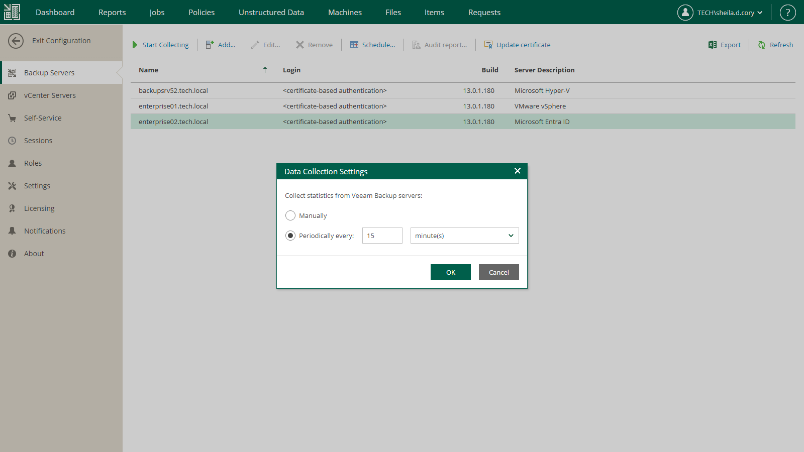
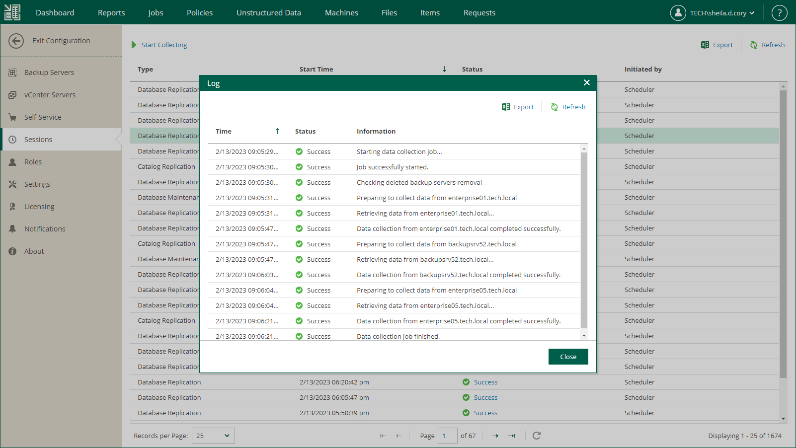

In this article

Veeam Backup Enterprise Manager retrieves data from added backup servers using a data collection job. The data collection job collects information from configuration databases of backup servers. The collected data is stored to the Veeam Backup Enterprise Manager configuration database and can be accessed by multiple users of Veeam Backup Enterprise Manager.

There are two options for running the data collection job:

* [Periodic data collection (default)](#periodical)
* [Manual data collection](#manual)

Every run of the data collection job initiates a new job session. For more information, see [Data Collection Job Sessions](#DataCollectionJobSessions).

|  |
| --- |
| Note |
| * Enterprise Manager automatically starts a data collection job right after you add a backup server. * Data collection job collects data from all added backup servers at once. * To ensure periodic update of the information available to Veeam Backup Enterprise Manager users, use periodic data collection. * Data collection from backup servers of earlier versions takes more time, which can be critical if many backup servers are added to Enterprise Manager. If you notice a low performance of the data collection job, consider upgrading the backup servers. |

Periodic Data Collection

By default, Veeam Backup Enterprise Manager collects data from added backup servers every 15 minutes.

To change the data collection interval, do the following:

1. Log in to Enterprise Manager using an administrative account.
2. To open the Configuration view, click Configuration in the upper-right corner.
3. Select the Backup Servers section on the left of the Configuration view.
4. Click Schedule on the toolbar.
5. In the Data Collection Settings window, specify the desired interval in the Periodically every option.
6. Click OK.

You can also disable periodic data collection. In this case, you can only start the data collection job manually.

To disable periodic data collection:

1. Select Backup Servers on the left of the Configuration view and click Schedule on the toolbar.
2. In the Data Collection Settings window, select the Manually option.
3. Click OK.

Manual Data Collection

You can start the data collection job manually at any time.

To start the data collection job manually:

1. Select Backup Servers on the left of the Configuration view.
2. Click Start Collecting on the toolbar.
3. To view the details on the started job session, click the Sessions link at the top or open the Sessions section of the Configuration view.

Data Collection Job Sessions

Every run of the data collection job initiates a new job session.

To view details on job sessions, to the following:

1. Select Sessions on the left of the Configuration view.
2. In the list of sessions, select the necessary session and click the link in the Status column.
3. In the displayed window, Veeam Backup Enterprise Manager shows the list of the job session events. For each job session event, Enterprise Manager shows the time of the event, its current status and information about the event.

Page updated 10/30/2025

Page content applies to build 13.0.1.1071
