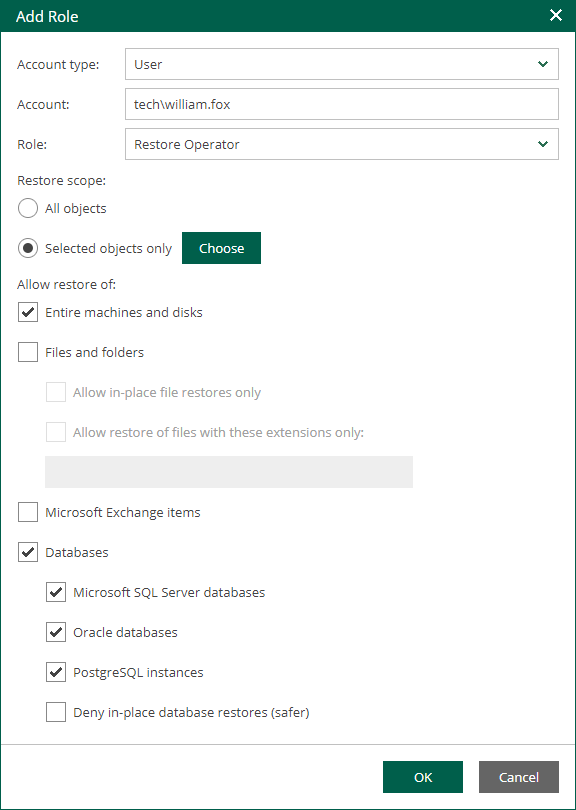
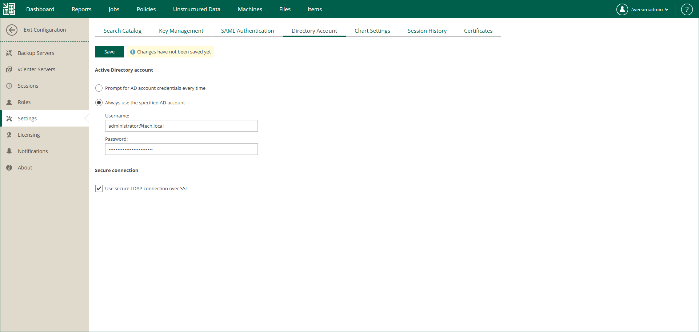

In this article

Accounts that you want to use for guest OS file restore and application item restore must have sufficient permissions.

By default, users can restore all types of files from available backups and replicas. Files can be restored either to the local machine or the original location. For security purposes, you can configure additional restrictions for the restore scope. For example, you can specify the list of file types available to the user or prohibit downloading of restored files at all.

To let users restore application items, you must assign a security role to the user account and allow the account to access and restore application items. For example, users responsible for Oracle database restore must be assigned an Enterprise Manager role and be able to restore Oracle databases.

To configure permissions for file and application item restore, take the following steps:

1. Log in to Enterprise Manager using an administrative account.
2. To open the Configuration view, click Configuration in the upper-right corner.
3. Select the Roles section on the left of the Configuration view.
4. Click Add to add an account, or select an existing account and click Edit.
5. In the Allow restore of section, to allow restore of entire machines and VM disks of machines included in the restore scope, select the Entire machines and disks check box.
6. To allow restore of guest OS files, select the Files and folders check box. If you select this check box, you can also select the following options:

* Allow in-place file restores only — select this option to allow file-level restore to the original location only. Consider that the restored files will be available only to accounts that have access to the original machine.
* Allow restore of files with these extensions only — select this option to define which file types are allowed for restore. In the text box, enter a list of extensions for allowed file types, separated by commas.

1. To allow restore of Microsoft Exchange items (mail, calendars, tasks), select the Microsoft Exchange items check box.
2. To allow restore of databases, select the Databases check box. If you select this check box, you can also select the following options:

* Select Microsoft SQL Server databases to allow restore of Microsoft SQL databases on machines included in the user's restore scope.
* Select Oracle databases to allow restore of Oracle databases on machines included in the user's restore scope.
* Select PostgreSQL instances to allow restore of PostgreSQL instances on machines included in the user's restore scope.
* Select Deny in-place database restores to restrict the user from overwriting the original databases during the database restore process.

1. Click OK to save the changes.
2. [For Microsoft Exchange items restore] Configure the settings of an Active Directory account that will be used to restore Microsoft Exchange items. For more information, see [Configuring Active Directory Account](#ConfiguringActiveDirectoryAccount).

Configuring Active Directory Account

You can either preconfigure an Active Directory account that will be used to restore Microsoft Exchange items or choose to specify an account every time you perform the restore operation.

To configure Active Directory account settings, take the following steps:

1. Open the Settings section of the Configuration view.
2. On the Directory Account tab, select one of the following options:

* Select Prompt for AD account credentials every time to specify an account every time you perform the restore operation. This allows you to avoid storing account credentials in the Enterprise Manager configuration database.

This option must be selected if you have Microsoft Exchange servers in different domains.

* Select Always use the specified AD account to use a specific account every time you restore Microsoft Exchange items with Veeam Backup Enterprise Manager. This option is useful if you want to delegate restore operations to a non-administrative user.

With this option selected, Microsoft Exchange servers must belong to the same Microsoft Active Directory forest.

In this case, specify an Active Directory account name and password. Make sure the account meets the following requirements:

* The account must be a member of the Organization Management group.
* The account must have sufficient rights to access mailboxes. To assign these rights, you can use Exchange Impersonation or grant the Full Access permission to the account. For more information on Exchange Impersonation, see [Microsoft Docs](http://msdn.microsoft.com/en-us/library/bb204095.aspx).

1. Select Use secure LDAP connection over SSL to set Enterprise Manager to connect to the domain controller over the SSL or TLS protocol.
2. Click Save to save the changes.

Page updated 11/18/2025

Page content applies to build 13.0.1.1071
