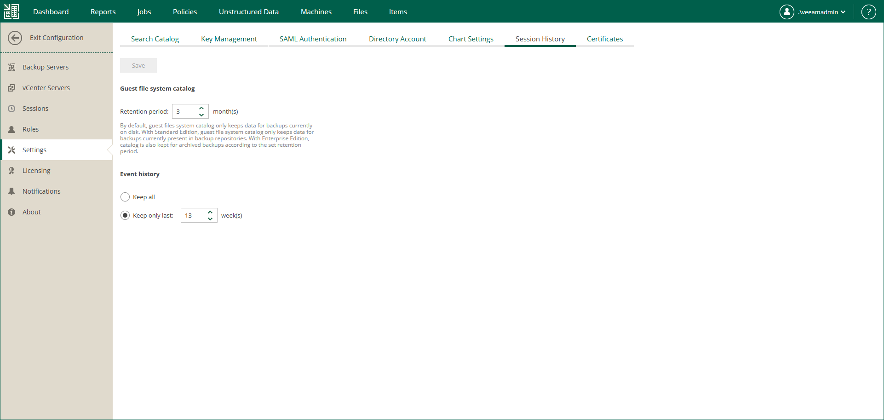
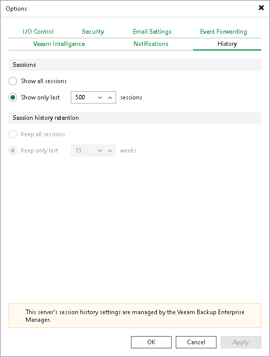

In this article

Veeam Backup Enterprise Manager allows you to configure retention settings for index files and event history. For details on data indexing, see [Veeam Backup Catalog](veeam_backup_catalog.md).

* If you use the Standard edition of Veeam Backup & Replication in your virtual environment, Veeam Backup Enterprise Manager keeps index files only for those backups that are currently stored on disk (that is, the backups are available on backup repositories).
* If you use the Enterprise or Enterprise Plus edition, Veeam Backup Enterprise Manager keeps index files for backups that are currently stored on disk and for archived backups (for example, backups that were recorded to tape). Thus, you will be able to browse and search through backup contents even if the backup in repository is no longer available or it was removed by Remove from Backups or Remove from Disk command in Veeam Backup console. For more information, see [Managing Backups](https://helpcenter.veeam.com/docs/vbr/userguide/managing_backups.html?ver=13) and [Managing Replicas](https://helpcenter.veeam.com/docs/vbr/userguide/manage_replicas.html?ver=13) sections of the Veeam Backup & Replication User Guide.

|  |
| --- |
| Important |
| Consider that, by default, backup repository is the primary destination for the search. This means, in particular, that if a backup (with indexed guest) is stored in both locations — repository and tape — then Enterprise Manager search results will only include files from backup stored in the repository. Files from tape-archived backup will appear in search results only if not found in the repository. |

To configure retention settings, take the following steps:

1. Log in to Enterprise Manager using an administrative account.
2. To open the Configuration view, click Configuration in the upper-right corner.
3. Open the Settings section on the left of the Configuration view.
4. On the Session History tab, in the Guest file system catalog section, specify how long index files must be stored on the Enterprise Manager server:

1. Enter the desired number of months in the Retention period, months field. The default value is 3 months, the minimum allowed value is 1 month, and the maximum allowed value is 99 months.
2. When finished, click the Save button under the Event history section. New retention settings will be saved in the Enterprise Manager database, and a message notifying you on the update will be displayed at the top of the window.

1. In the Event history section, specify the period for which Enterprise Manager should keep historical data available in the main working area of the Enterprise Manager website.

1. Enter the desired number of weeks or select Keep all. By default, the retention period for session data is set to 13 weeks. The minimum allowed value is 1 week, and the maximum allowed value is 999 weeks.
2. When finished, click Save. New retention settings will be saved in the Enterprise Manager database, and a message notifying you on the update will be displayed at the top of the window.

Note that the retention settings you specify in Enterprise Manager are propagated to all backup servers connected to it. These settings override the Session history retention values specified in Veeam Backup & Replication. For example, if the retention option of a backup server is set to keep the session history for 15 weeks, and in Enterprise Manager you select to Keep only last 13 weeks, the Enterprise Manager value will be propagated to the backup server; so the history will be kept for 13 weeks.

Page updated 11/18/2025

Page content applies to build 13.0.1.1071
