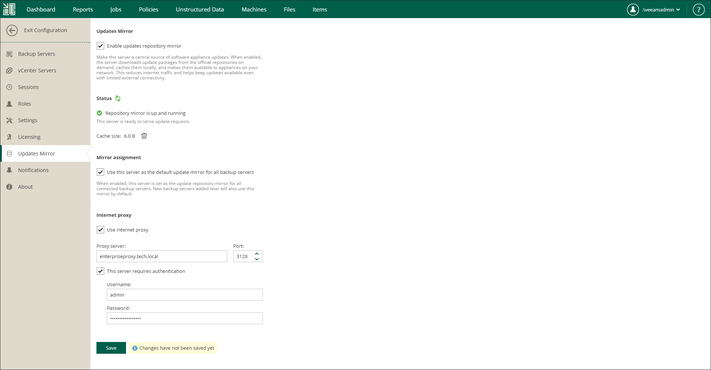

# Configuring Updates Mirror

By default, Veeam Software Appliance updates for Enterprise Manager, backup servers and backup server components are installed from the Veeam Update Repository (https://repository.veeam.com/vsa). You can configure a local mirror of the Veeam Update Repository to reduce internet traffic or ensure that all components can be updated when internet connectivity is limited. In particular, you can set the Enterprise Manager machine as a mirror repository. For details about specifying another server as a local mirror, see [Configuring Updates](update_appliance_configure_updates.md).

|  |
| --- |
| Note |
| The directory structure of your mirror repository must be identical to the Veeam Update Repository, except for the base URL. For example:   * https://repository.tech.local/<veeamosreleaseversion>/vbr/<veeamproductversion>/mandatory/ * https://repository.tech.local/<veeamosreleaseversion>/vbr/<veeamproductversion>/optional/ * https://repository.tech.local/<veeamosreleaseversion>/external-mandatory/ |

To configure Enterprise Manager as a mirror of the Veeam Update Repository, follow these steps:

1. Sign in to Veeam Backup Enterprise Manager using an account with the Portal Administrator role.
2. In the upper-right corner, click Configuration.
3. In the Configuration view, open the Updates Mirror section.
4. To enable the mirror of the Veeam Update Repository on Enterprise Manager, select Enable updates mirror.
5. To use this mirror not only to install updates for Enterprise Manager but also for all added backup servers and their components, select Use this server as the default update mirror for all backup servers.
6. If Enterprise Manager does not have direct access to the internet, you can configure a dedicated internet proxy server. To specify an internet proxy, do the following:

1. Select Use internet proxy.
2. In the Proxy server field, specify a DNS name or IP address of the server that has access to the internet and that you want to use as your internet proxy.
3. In the Port field, specify a port number over which to connect to the specified server.
4. To provide authentication credentials to access the internet proxy, select This server requires authentication and enter the username and password.

Page updated 2026-07-29

