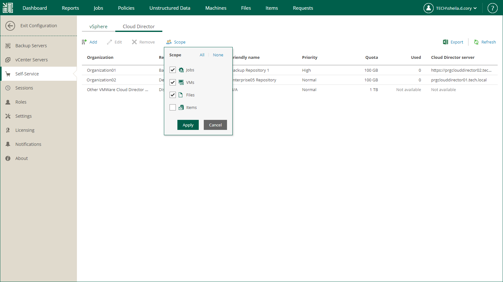

In this article

Users with the Portal Administrator role can configure what operations are available for portal users by choosing the tabs that must displayed in Veeam Self-Service Backup Portal. By default, all portal tabs are displayed. The Dashboard tab is always available in the portal. You can change visibility of the following portal tabs:

* [Jobs](em_vcd_self_service_manage_jobs.md)
* [VMs](em_vcd_self_service_restore.md)
* [Files](em_vcd_self_service_restore_files.md)
* [Items](em_vcd_self_service_restore_items.md)

To change visibility of Veeam Self-Service Backup Portal tabs, do the following:

1. Log in to Veeam Backup Enterprise Manager using an administrative account.
2. Click Configuration in the upper-right corner.
3. In the Configuration view, select the Self-service section.
4. In the Self-service section, select the Cloud Director tab.
5. Click Scope and select the tabs that you want to be displayed.
6. To save the settings, click Apply.

Page updated 10/30/2025

Page content applies to build 13.0.1.1071
