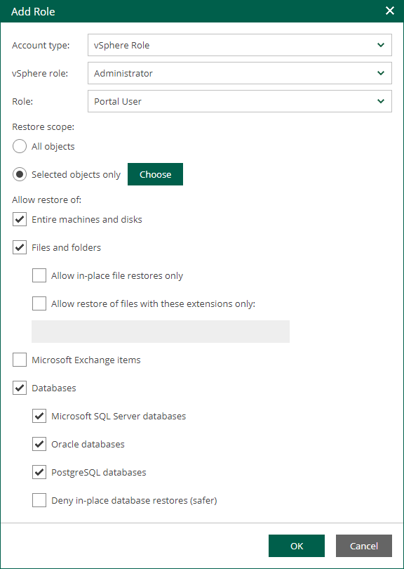

In this article

If you use a remotely installed [Veeam Plug-in for VMware vSphere Client](remote_vsphere_client_plugin.md), you need to map one of the Veeam Backup Enterprise Manager roles with a VMware vSphere role that you will use to log in to the remote vSphere Client plug-in.

To add a VMware vSphere role, take the following steps:

1. Log in to Enterprise Manager using an administrative account.
2. To open the Configuration view, click Configuration in the upper-right corner.
3. Select the Roles section on the left of the Configuration view.
4. Click Add on the toolbar.
5. From the Account type list, select vSphere Role.
6. From the vSphere role list, select a vCenter Server role created in VMware vSphere.
7. From the Role list, select a role you want to assign to the account: Portal Administrator, Portal User or Restore Operator. For more information, see [Roles](em_about_accounts_and_roles.md#roles).

|  |
| --- |
| Note |
| To be able to assign any of portal roles to Active Directory domain users or groups, make sure that Veeam Backup Enterprise Manager service account has sufficient rights to enumerate Active Directory domains (by default, Active Directory users have enough rights to enumerate Active Directory domains). |

1. [For Portal User or Restore Operator] In the Restore scope section, you can allow a user to restore all objects (machines and file shares) processed by managed backup servers or the selected objects only. For more information, see [Configuring Restore Scope](veeam_backup_em_restore_scope.md).

In the Allow restore of section, you can configure additional restrictions for the restore scope. For more information, see [Configuring Permissions for File and Application Item Restore](configuring_restrictions_for_restore.md).

Page updated 10/30/2025

Page content applies to build 13.0.1.1071
