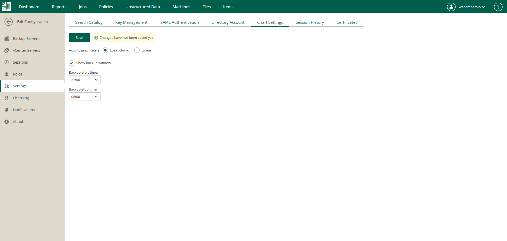

In this article

You can customize the appearance of the Backup Servers chart that you can see on the Enterprise Manager dashboard.

|  |
| --- |
| Important |
| Backup window interval that you specify here, effects the job settings that you configure for tenants that use the following portals:   * [vSphere Self-Service Backup Portal](em_working_with_vsphere_portal.md) * [Veeam Self-Service Backup Portal for Cloud Director](em_working_with_vcd_vms.md) |

To customize the appearance of the chart, do the following:

1. Log in to Enterprise Manager using an administrative account.
2. To open the Configuration view, click Configuration in the upper-right corner.
3. Select the Settings section on the left of the Configuration view.
4. Select the Chart Settings tab.
5. Use the Activity graph scale options to switch between graph types: Linear and Logarithmic.
6. Select the Show backup window check box to highlight the backup window on the dashboard chart.
7. Specify time interval for the backup window. Default interval is from 8:00 PM to 8:00 AM. You can change the interval to correlate with your planned backup window by editing the start and stop time.
8. To save the changes, click Save.

Page updated 11/19/2025

Page content applies to build 13.0.1.1071
