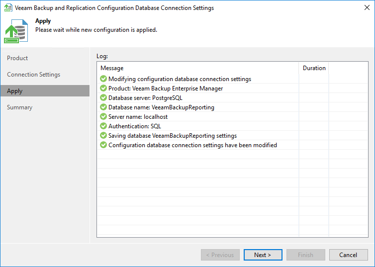

# Step 4. Apply Connection Settings

At the Apply step of the wizard, the utility applies database connection settings. Wait for the operation to complete and click Next to proceed to the Summary step of the wizard.

Previously stopped services will be started again at this moment.

