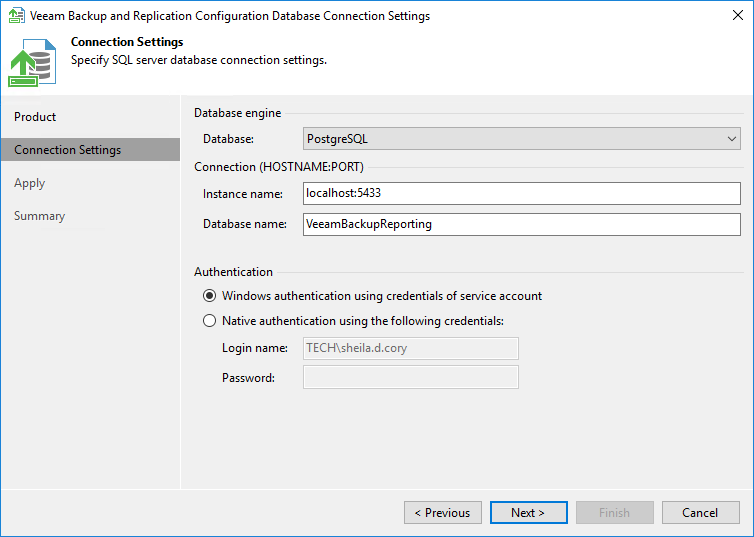
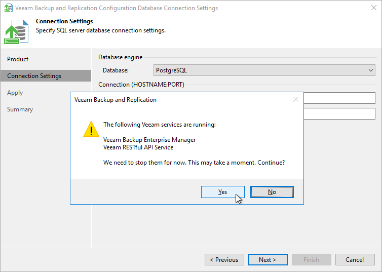

# Step 3. Specify Connection Settings

At the Connection Settings step of the wizard, provide the connection settings for the configuration database.

1. Select one of the following database engines:

* PostgreSQL
* Microsoft SQL Server

1. Specify database settings:

* [For PostgreSQL] Specify the instance name in the HOSTNAME:PORT format. In the Database name field, specify a name for the Veeam Backup Enterprise Manager configuration database.

* [For Microsoft SQL Server] Specify the Microsoft SQL Server instance and database name to which you want the Veeam Backup & Replication installation to connect. Both local and remote Microsoft SQL Server instances are supported. Microsoft SQL Server instances available on the network are shown in the Server name list. If necessary, click Refresh to get the latest information.

If a database with the specified name does not exist on the selected Microsoft SQL Server instance, it will be created anew.

1. Select an authentication method that will be used for database connection:

* If you plan to use the Microsoft Windows authentication, consider that the current service account will be used (that is, the account under which the Veeam Backup Enterprise Manager Service is running).
* If you plan to use native database server authentication, provide a login name and password. To view the entered password, click and hold the eye icon on the right of the Password field.

[For Microsoft SQL Server] When you migrate the configuration database to another server, you must use the Microsoft SQL Server credentials that have CREATE ANY DATABASE permission on the target Microsoft SQL Server. For details, see [Microsoft Docs](https://docs.microsoft.com/en-us/sql/relational-databases/security/authentication-access/server-level-roles?view=sql-server-ver15). After database creation, this account automatically gets a db\_owner role and can perform all operations with the database. If the current account does not have this permission, a Database Administrator may create an empty database in advance and grant the db\_owner role to the account that will be used for migration of the configuration database.

1. Click Next.

1. Before proceeding, the utility validates the specified settings to make sure that the specified user account has enough privileges to access the database.

To ensure that the account (as well as the account under which the Veeam Backup Enterprise Manager Service is running) have sufficient privileges for database access, you can contact your database administrator. Refer to the list of [required permissions](required_permissions.md) for detailed information.

For the new settings to be applied, the utility needs to stop Veeam Backup Enterprise Manager services that are currently running. Before proceeding to the next step, you must confirm the operation by clicking Yes.

