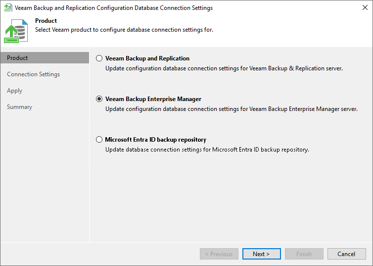

In this article

The Product step of the wizard is displayed if you have both a Veeam Backup Enterprise Manager server and backup server installed on the local machine. In this case, select a product whose configuration database settings you want to change.

If a backup server, Microsoft Entra ID backup repository or Enterprise Manager server is not installed on the machine, the Product step of the wizard is skipped.

Page updated 12/11/2025

Page content applies to build 13.0.1.1071
