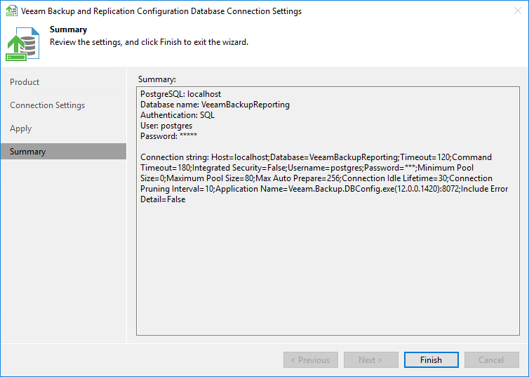

In this article

At the Summary step of the wizard, view the information about the changes in database connection settings and click Finish.

|  |
| --- |
| Note |
| If you are configuring Veeam Backup & Replication database settings and you want the Veeam backup management console to start automatically after you finish working with the wizard, select the Start the product automatically check box. The option is not available for Veeam Backup Enterprise Manager. |

Page updated 11/10/2025

Page content applies to build 13.0.1.1071
