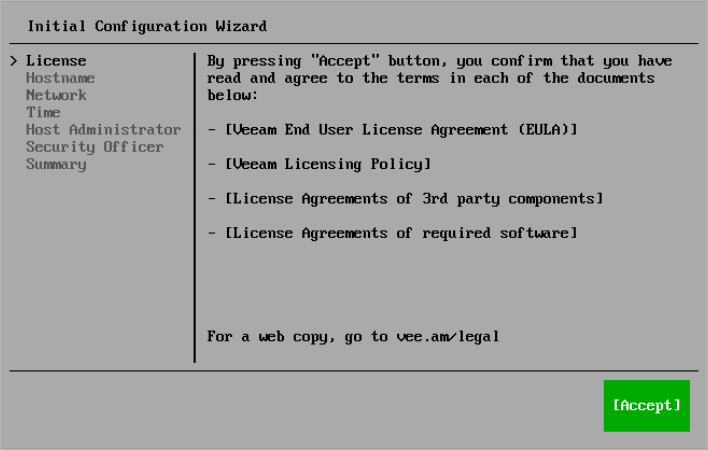

In this article

At the License step of the Initial Configuration wizard, read and accept Veeam license agreements and policies.

|  |
| --- |
| Tip |
| To close a document you have read, press [Q]. |

Page updated 9/3/2025

Page content applies to build 13.0.1.1071
