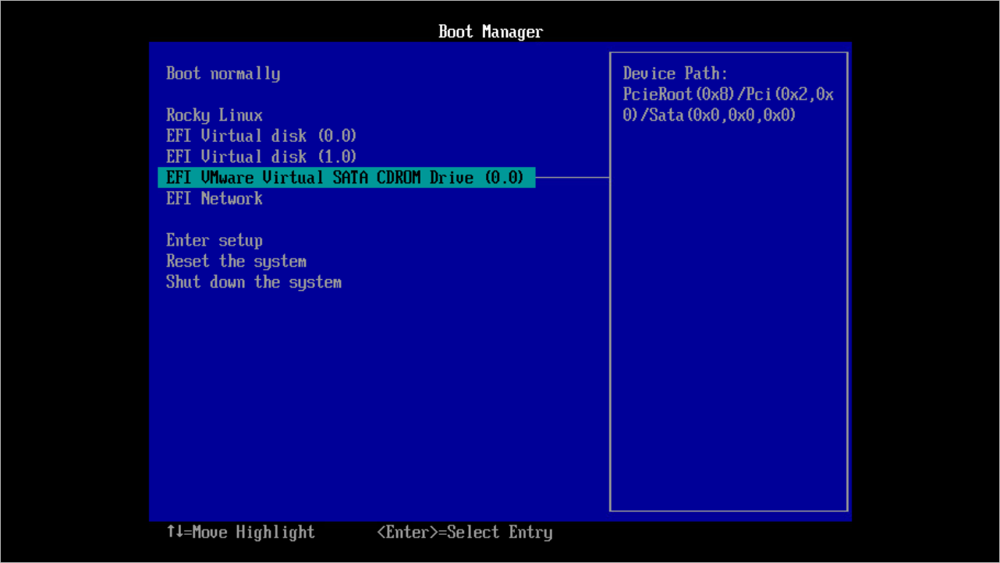

In this article

To start the setup wizard, perform the following steps:

1. Download the latest version of the ISO file from the [Product Downloads](https://my.veeam.com/my-products) section of your Veeam account.
2. Mount the ISO file to the machine where you plan to install Veeam Software Appliance or burn the ISO file to a flash drive or other removable storage device. If you plan to install Veeam Software Appliance on a virtual machine, use the built-in tools of the virtualization management software to mount the ISO file.

|  |
| --- |
| Note |
| To create a bootable USB stick, it is recommended that you use [Rufus](https://rufus.ie/en/) with the default settings. Note that you need to select Write in DD Image mode option when prompted. |

1. In the Boot Manager, select the drive where you mounted the ISO file and press [Enter].

Page updated 9/24/2025

Page content applies to build 13.0.1.1071
