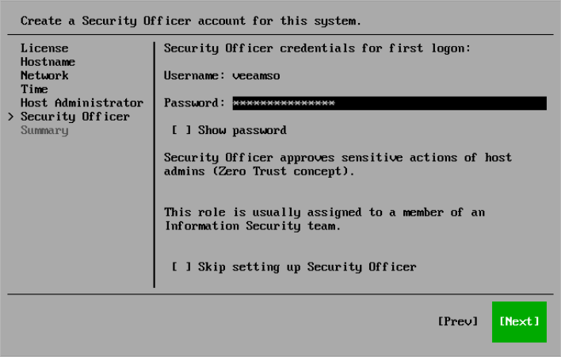

# Step 9. Configure Security Officer Account

At the Security Officer step of the Initial Configuration wizard, configure the default security officer account to perform specific operations in the Host Management console — veeamso. This account type provides an additional security layer to protect your infrastructure against malicious system administration. For more information about operations available for this role, see [Managing Users and Roles](hmc_users.md).

|  |
| --- |
| Note |
| If you do not want to configure the security officer account, select Skip setting up Security Officer. To enable this account later, you will have to reinstall Veeam Software Appliance and complete the initial configuration. |

To configure the security officer account, do the following:

1. In the Password field, specify the password for the veeamso user. The password must comply with the following requirements:

* 15 characters minimum.
* 1 upper case character.
* 1 lower case character.
* 1 numeric character.
* 1 special character.
* No more than 4 characters of the same class in a row. For example, more than 4 lowercase or 4 numerical characters in sequence.

|  |
| --- |
| Tip |
| To view the password, select Show Password and press the spacebar. |

1. Select Next.

When a security officer first logs in to the Host Management console, they must complete the initial setup. For more information, see [Performing Initial Security Officer Login](hmc_users_security_officer.md).

