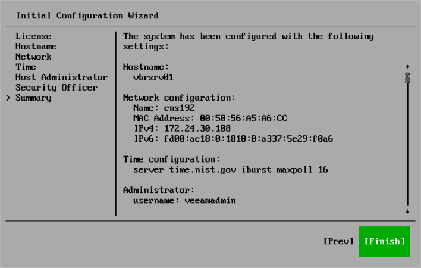

# Step 10. Finish Configuration

At the Summary step of the Initial Configuration wizard, review the system configuration and select Finish. The system will apply the configuration and restart required services.

After you finish the initial configuration, general information about the server will be displayed. You can use it to log in to the Host Management console or Veeam Backup & Replication web UI and continue configuring Veeam Software Appliance and Veeam Backup & Replication.

|  |
| --- |
| Important |
| If you did not configure or disabled multi-factor authentication in the Initial Configuration wizard, Veeam Backup & Replication and the Web UI will be unavailable until you have configured MFA in the Host Management console. |

Related Topics

* [Host Management](em_vhm.md)
* [Configuring Enterprise Manager](em_infrastructure_config.md)

Page updated 2026-06-25

