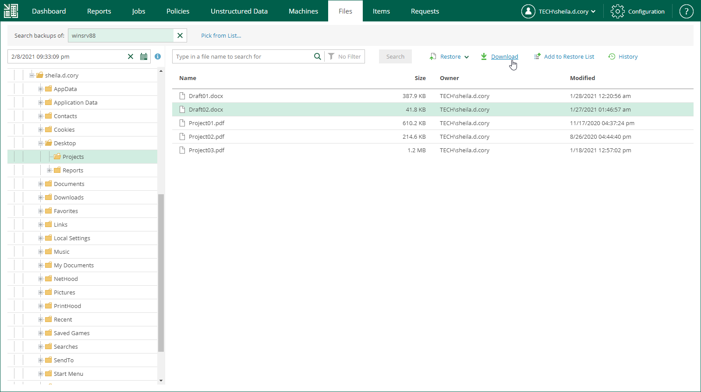
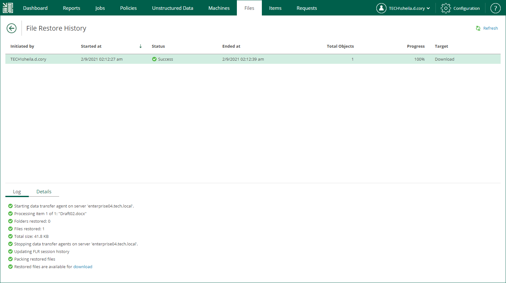

In this article

You can download file system objects (files and folders) to your local machine. After you choose to download the objects, Veeam Backup Enterprise Manager interacts with the backup server to extract them from a backup and saves them to the default download folder on your local machine. If you download a single file, it is also saved in the %ProgramData%\Veeam\Backup\WebRestore folder. Multiple files are packed in a ZIP file named FLR\_<date>\_<time>.zip and stored in the same folder. Veeam Backup Enterprise Manager cleans up the folder periodically. Files older than 24 hours are automatically deleted. To change the default storage folder, contact [Veeam Customer Support](https://www.veeam.com/support.html).

To download objects to the local machine, do the following:

1. Find the objects you want to restore. You can select one or multiple objects. For details, see [Browsing Machine Backups for Guest OS Files](browsing_vm_backups.md) and [Searching for Guest OS Files in Machine Backups](searching_vm_backups.md).
2. Click Download.

1. In the displayed window, click Yes.
2. Wait for restore session to complete and for the objects to be retrieved from the backup.
3. In the File Restore History view, select the restore session from the list.
4. On the Log tab, find the Restored files are available for download record of the session log and click the download link.

Page updated 12/4/2023

Page content applies to build 13.0.1.1071
