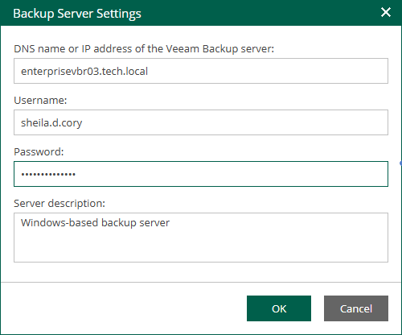

In this article

After a backup server was added to the Enterprise Manager infrastructure, you can edit connection settings. After you specify new connection settings, Enterprise Manager will try to connect to the backup server using these settings. If you specify credentials, Veeam Backup Enterprise Manager Service will send them to the backup server for the initial authentication. Otherwise, the Enterprise Manager certificate will be used.

To edit connection settings of a backup server, do the following:

1. Log in to Enterprise Manager using an administrative account.
2. To open the Configuration view, click Configuration in the upper-right corner.
3. Select the Backup Servers section on the left of the Configuration view.
4. Select a backup sever from the list and click Edit on the toolbar.

Alternatively, you can right-click the selected backup server and select Edit.

1. Specify new connection settings and click OK.

Page updated 10/30/2025

Page content applies to build 13.0.1.1071
