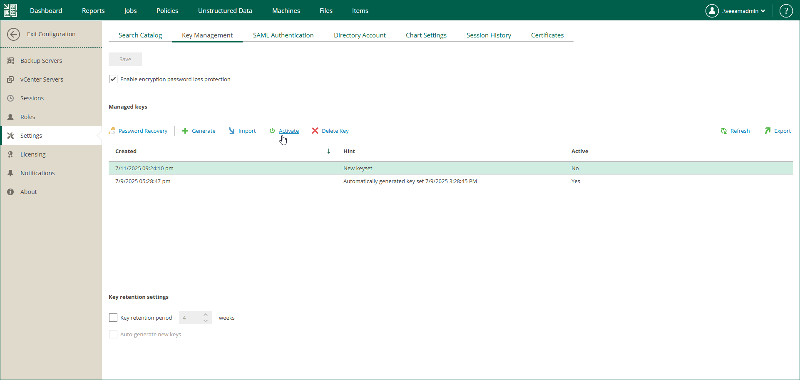

In this article

Active Enterprise Manager keys are the keys that are currently used in the encryption process. After you generate a new keyset, you need to activate it. As a result of activation, Veeam Backup Enterprise Manager performs the following actions:

* Public Enterprise Manager key is propagated to all Veeam backup servers connected to Veeam Backup Enterprise Manager.
* Private Enterprise Manager key remains on Veeam Backup Enterprise Manager and marked as active.

Enterprise Manager keys can be activated automatically or manually. If you want your automatically generated keysets to be activated automatically upon creation, configure the retention policy settings. For more information, see [Specifying Retention Settings for Enterprise Manager Keyset](em_retention_for_em_keys.md).

You can perform manual activation for any keyset (generated manually or automatically). Manually generated keysets require manual activation.

To activate a keyset manually, do the following:

1. In Veeam Backup Enterprise Manager, open the Settings section of the Configuration view.
2. On the Key Management tab, in the Managed keys section, select an inactive keyset in the list and click Activate.

Page updated 11/10/2025

Page content applies to build 13.0.1.1071
