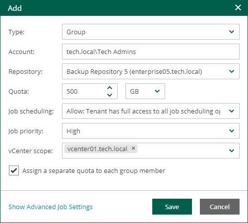
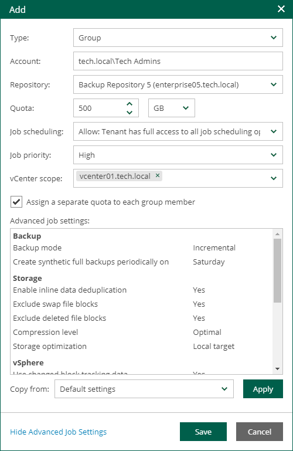

# Adding Tenant Account

Veeam Backup Enterprise Manager offers the default Domain Users account for vSphere Self-Service Backup Portal tenants. It is a group account that includes all users from the Enterprise Manager server domain. To configure granular access to storage quotas and backup settings, the Enterprise Manager administrator can add new tenant accounts.

Before you add a tenant account, consider the following:

* If you plan to provide a user with access to vSphere Self-Service Backup Portal only, and not to the main Enterprise Manager UI, you do not need to configure an account for this user on the Roles tab of the Configuration view.
* The vSphere tab is not displayed if all your vCenter Servers are added as part of VMware Cloud Director infrastructure and you do not have any tenant accounts that were previously added for one of the vCenter Servers.

To add a tenant account for vSphere Self-Service Backup Portal:

1. Log in to Veeam Backup Enterprise Manager using an administrative account.
2. To open the Configuration view, click Configuration in the upper-right corner.
3. In the Configuration view, select the Self-service section.

The Self-service section is available if you have added to Enterprise Manager at least one Veeam backup server with a vCenter Server as part of its infrastructure.

1. If a VMware Cloud Director server is added to your Veeam backup infrastructure, make sure that the vSphere tab is selected.
2. Click Add.

1. From the Type drop-down list, select a type of the account: User, Group, External User or External Group. For more information, see [Managing Tenant Accounts](em_managing_tenants.md).
2. In the Account field, specify an account name in the DOMAIN\Username or Username@Suffix format depending on the account type. For more information, see [Managing Tenant Accounts](em_managing_tenants.md).

|  |
| --- |
| Note |
| You cannot create a vSphere Self-Service Backup Portal tenant account for a local user account. |

1. From the Repository drop-down list, select a target repository that will contain VM backups created by the tenant. The list includes repositories configured on Veeam backup servers added to Veeam Backup Enterprise Manager.

Backup repository settings specified at this step will take priority over backup repository settings prescribed by the selected job template.

|  |
| --- |
| Note |
| You cannot assign to tenants Veeam Cloud Connect repositories, as well as NetApp or Nimble storage systems storing snapshots created by Veeam snapshot-only jobs. |

1. In the Quota field, specify the repository storage quota for the tenant account. Choose GB or TB from the drop-down list and enter the required quota size.
2. From the Job scheduling drop-down list, select how the job scheduling will be organized. The following options are available:

* Allow: Tenant has full access to all job scheduling options
* Allow: Tenant can create daily and monthly jobs only
* Deny: Creates daily jobs with randomized start time within the backup window

For tenant backup jobs, the backup window is defined by backup window settings specified in Veeam Backup Enterprise Manager. Backup window settings specified for the job template that you will select at the step 12 do not affect tenant jobs. For information on how to specify the backup window in Enterprise Manager, see [Customizing Dashboard Chart](customizing_dashboard_chart.md).

* Deny: Creates job with no schedule assigned

For more information on job scheduling, see [Edit Job Schedule](jobs_edit_schedule.md).

1. From the Job priority drop-down list, select a normal or high priority for backup jobs of the tenant.
2. If you have multiple vCenter Servers in your infrastructure and want to provide the tenant account with access to VMs of specific vCenter Servers only, from the vCenter scope drop-down list, select the necessary vCenter Servers. By default, the All vCenter Servers options is selected.
3. If you have selected the delegation mode that is based on vSphere tags, in the vSphere tags field, specify tags assigned to VMs that will be available to the tenant.

For more information on delegation modes, see [Configuring Delegation Mode](em_configuring_delegation_mode.md).

1. If you add a tenant account of the Group or External Group type, select the Assign a separate quota to each group member check box to provide each user of the group with individual quota on the backup repository. Each user will be able to work with backup jobs and VM backups created by this user only. Backups and jobs of other users will not be displayed.

1. Specify advanced settings for backup jobs of the tenant:

1. Click the Show Advanced Job Settings link.
2. In the Advanced job settings section, view the currently used backup job settings.
3. From the Copy from list, select the advanced settings that you want to apply to tenant jobs. For more information on the specific settings, see the [Specify Advanced Backup Settings](https://helpcenter.veeam.com/docs/vbr/userguide/backup_job_advanced_vm.html?ver=13) section of the Veeam Backup & Replication User Guide.

* Select Default settings to use the default advanced settings as they are shown in the Veeam Backup & Replication console. This option is applied by default.
* Select <Job name> to use the advanced settings of an existing backup job as a template for tenant backup jobs. When a tenant creates a backup job on the vSphere Self-Service Backup Portal, Enterprise Manager will copy the advanced settings from the template and apply them to the job.

Note that, in the Copy from list, Enterprise Manager displays only VMware vSphere backup jobs that are configured in advance on a backup server added to Enterprise Manager.

1. To apply the job template, click Apply.

1. To add the account, click Save.

